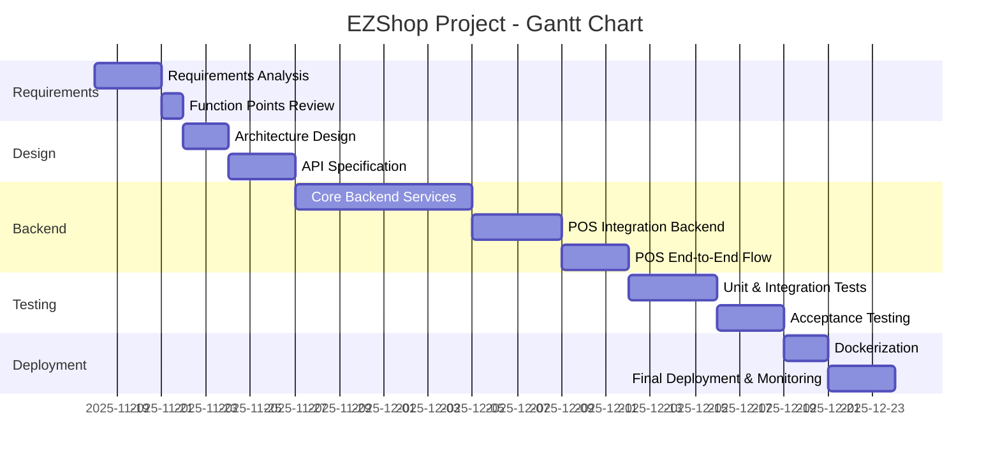

# Project Estimation

Date: 17 Nov 2025

Version: 2

# Estimation approach

Consider the EZShop project as described in your requirements document, assume that you are going to develop the project INDEPENDENT of the deadlines of the course, and from scratch

# Estimation by size

###

|                                                                                                         | Estimate    |
| ------------------------------------------------------------------------------------------------------- | --------    |
| NC = Estimated number of classes to be developed                                                        |  25         |
| A = Estimated average size per class, in LOC                                                            |  200        |
| S = Estimated size of project, in LOC (= NC \* A)                                                       |  5000       |
| E = Estimated effort, in person hours (here use productivity 10 LOC per person hour)                    |500 ph       |
| C = Estimated cost, in euro (here use 1 person hour cost = 30 euro)                                     |15000 euro    |
| Estimated calendar time, in calendar weeks (Assume team of 5 people, 8 hours per day, 5 days per week ) |  2.5         |

# Estimation by Function Points
In order to give a more precise forecast of the size of our project we can do an estimation using FP.\
Here are presented the evaluation of the various components with the associated weights.
### External Inputs (EI)
| ID  | Description                                         | Complexity | Weight |
|:---:|:----------------------------------------------------|:-----------|:-------:|
| EI1 | Read sale from cash register                        | Avg        | 4      |
| EI2 | Import sales/product/batch/order CSV                | High       | 6      |
| EI3 | CRUD Catalogue                                      | Avg        | 4      |
| EI4 | CRUD Inventory (Batches)                            | Avg        | 4      |
| EI5 | CRUD Orders                                         | Avg        | 4      |
| EI6 | CRUD Notifications                                  | Low        | 3      |
| EI7 | CRUD Cash Registers                                 | Low        | 3      |
| EI8 | Set / Change Password                               | Low        | 3      |
| EI9 | Authenticate / Verify Password                      | Avg        | 4      |
| EI10| Import products list from .csv                      | High       | 6      |
| EI11| Import batches list from .csv                       | High       | 6      |
| EI12| Import orders list from .csv                        | High       | 6      |
| EI13| Import refunds list from .csv                       | High       | 6      |
| EI14| Import suppliers list from .csv                     | Avg        | 4      |
| EI15| Import invoices list from .csv                      | Avg        | 4      |
| EI16| Link POS provider (redirect to auth URL)            | Avg        | 4      |
| EI17| Retrieve access & refresh token (POS)               | Avg        | 4      |
| EI18| Encrypt access token / store securely               | Avg        | 4      |
| EI19| Retrieve new token when expired (POS)               | Avg        | 4      |
| EI20| Push catalogue to cash register (convert + send)    | Avg        | 4      |
| EI21| Pull sales list from cash registers (manual/API)    | Avg        | 4      |
| EI22| Detect import errors / schema mismatch (CSV import) | Low        | 3      |
| EI23| Add suggested order to orders list                  | High       | 6      |

**Total EI = 103**

---

### External Outputs (EO)
| ID  | Description                                               | Complexity | Weight |
|:---:|:----------------------------------------------------------|:-----------|:------:|
| EO1 | Update Catalogue to Cash Register                         | Avg        | 5      |
| EO2 | Export lists to CSV                                       | Avg        | 5      |
| EO3 | Send updated catalogue                                    | Avg        | 5      |
| EO4 | Generate order suggestion                                 | High       | 7      |
| EO5 | Compute and display balance reports                       | High       | 7      |
| EO6 | Retrieve invoices and incomes/outgoings reports           | Avg        | 5      |
| EO7 | Export products list as .csv                              | Avg        | 5      |
| EO8 | Export batches list as .csv                               | Avg        | 5      |
| EO9 | Export refunds list as .csv                               | Avg        | 5      |
| EO10| Export orders list as .csv                                | Avg        | 5      |
| EO11| Export suppliers list as .csv                             | Avg        | 5      |
| EO12| Export invoices list as .csv                              | Avg        | 5      |
| EO13| Send confirmation / notification after catalogue push     | Avg        | 5      |

**Total EO = 69**

---

### External Inquiries (EQ)
| ID  | Description                                                       | Complexity | Weight |
|:---:|:------------------------------------------------------------------|:-----------|:------:|
| EQ1 | Retrieve filtered sales/products/batches/orders/invoices          | Avg        | 4      |
| EQ2 | Retrieve ranked sales                                             | Avg        | 4      |
| EQ3 | Retrieve number of items available per product                    | Low        | 3      |
| EQ4 | Retrieve order status                                             | Low        | 3      |
| EQ5 | Retrieve income/expense/balance history                           | Avg        | 4      |
| EQ6 | Retrieve filtered refunds / refunds by product                    | Avg        | 4      |
| EQ7 | Retrieve ranked refunds (by items / amount)                       | Avg        | 4      |
| EQ8 | Retrieve suppliers list filtered by product                       | Avg        | 4      |
| EQ9 | Retrieve suppliers ranked by associated purchase orders           | Avg        | 4      |
| EQ10| Retrieve shipping companies filtered by attributes                | Avg        | 4      |
| EQ11| Retrieve shipment/tracking status from courier API                | Avg        | 4      |
| EQ12| Retrieve products below threshold (for suggestions)               | Avg        | 4      |

**Total EQ = 46**

---

### External Interface Files (EIF)
| ID   | Description                      | Complexity | Weight |
|:----:|:----------------------------------|:-----------|:------:|
| EIF1 | Cash register API data            | Avg        | 7      |
| EIF2 | Supplier API data                 | Avg        | 7      |
| EIF3 | External CSV files                | Low        | 5      |
| EIF4 | Shipping / Courier API data       | Avg        | 7      |

**Total EIF = 26**

---

### Internal Logical Files (ILF)
| ID   | Description                        | Complexity | Weight |
|:----:|:-----------------------------------|:-----------|:------:|
| ILF1 | Sales                              | Avg        | 10     |
| ILF2 | Catalogue                          | Avg        | 10     |
| ILF3 | Inventory (Batches)                | Avg        | 10     |
| ILF4 | Orders                             | Avg        | 10     |
| ILF5 | Invoices                           | Avg        | 10     |
| ILF6 | Accounting data                    | Avg        | 10     |
| ILF7 | Users / Owner credentials          | Low        | 7      |
| ILF8 | Notifications                      | Low        | 7      |
| ILF9 | Cash Registers list                | Low        | 7      |
| ILF10| Refunds                            | Avg        | 10     |
| ILF11| Suppliers                          | Avg        | 10     |
| ILF12| Shipping Companies                 | Avg        | 10     |

**Total ILF = 111**

---

## Total UFP - Unadjusted Function Points

- EI = 103  
- EO = 69  
- EQ = 46  
- EIF = 26  
- ILF = 111  

**Grand Total = 355 UFP**\
It is needed to calculate the Adjusted Function Points in order to provide a more accurate measure of the\
project's scope. For this reason, Technical Complexity Factors and Environmental Complexity Factors are\
needed to adjust the UFP.

## Technical Complexity Factors (TCF) — Values and Justifications
**TCF = 0.6 + (0.01 * TFW)**\
TFW stands for Technical Factor Weight
- It's calculated starting from 14 Technical Complexity Factors **T**

| ID  | Factor (T)                | Value (0–5) | Short justification                                                                 |
|:---:|:--------------------------|:-----------:|:-----------------------------------------------------------------------------------|
| T1  | Data communications       | 4           | Many POS / courier integrations → significant API data exchanges.                 |
| T2  | Distributed processing    | 2           | Logic mainly centralized; a few distributed components.                           |
| T3  | Performance               | 4           | Response time and catalogue/sales synchronization are time-sensitive.            |
| T4  | Heavily used configuration| 3           | Medium/high backend loads during peak periods.                                    |
| T5  | Transaction rate          | 4           | High number of transactions from cash registers / periodic imports.               |
| T6  | Online data entry         | 3           | Online entries for orders/stock/users but not massive.                            |
| T7  | End-user efficiency       | 3           | Usability requirements important for owners/operators.                           |
| T8  | Online update             | 4           | Catalogue and inventory updates in real time toward POS.                         |
| T9  | Complex processing        | 3           | Moderate logic: suggestions, reporting, reconciliations.                          |
| T10 | Reusability               | 2           | Some components reusable; not a driving requirement.                              |
| T11 | Installation ease         | 2           | Deployment involves tokens/encryption; not straightforward.                       |
| T12 | Operational ease          | 3           | Monitoring and notifications required; moderate operational needs.               |
| T13 | Multiple sites            | 3           | Multiple cash registers and potentially multiple sites → multi-site support.     |
| T14 | Facilitate change         | 4           | System must be easily modifiable / extensible.                                    |
|   ||**TOTAL TFW=44**

**TCF = 0.6+(0.01*44) = 1.04**

## Environmental Complexity Factors (ECF) — Values and Justifications
**ECF=1.4+(-0.03*EF)**
| ID  | Factor                           | Value (0–5) | Justification                                                                 |
|:---:|:---------------------------------|:-----------:|:-------------------------------------------------------------------------------|
| E1  | Familiarity with programming     | 4           | All team members have degrees in Computer Science/Engineering; good language knowledge. |
| E2  | Application experience           | 3           | Moderate experience with similar applications (management/POS) in university projects. |
| E3  | Analyst capability               | 4           | Good requirements analysis skills thanks to academic background.              |
| E4  | Software engineering capability  | 4           | Good theoretical knowledge and university practice; limited industrial support. |
| E5  | Virtual machine experience       | 2           | Use of VMs and virtualized environments for courses; limited industrial experience. |
| E6  | Programming language experience  | 4           | Solid knowledge of main languages (Java, Python, SQL).                         |
| E7  | Motivation                       | 4           | Team is motivated and engaged in the project.                                  |
| E8  | Stability of requirements        | 3           | Requirements defined in course documents, but some details may change.        |
|||**TOTAL EF=28**

**ECF=1.4+(-0.03*28)=0.56**

## AFP - Adjusted Function Points
Given the values calculated in the previous sections we can finally evalute the AFP as:\
**AFP =UFP * TCF * ECF = 355 * 1.04 * 0.56= 206,75**\
Assuming that the project will be devolped using Python as coding language, with an\
an estimation of about *25 LOC/FP* we can forecast a total of about\
**AFP * 25=206.75 * 25 = 5169 LOC**
** **

# Estimation by product decomposition

###

| component name                                                | Estimated effort (person hours) |
| ------------------------------------------------------------  | ------------------------------- |
| _requirement document_                                        |              100                |
| _design document_                                             |              150                |
| _Desktop front-end_                                           |               85                |
| &nbsp;&nbsp;  _UI Login-page_                                 |               3                 |
| &nbsp;&nbsp;  _Dashboard page_                                |               12                |
| &nbsp;&nbsp;  _Catalogue page_                                |               8                 |
| &nbsp;&nbsp;&nbsp; catalogue filters and user-defined list    |               4                 |
| &nbsp;&nbsp;&nbsp; manual insertion of the product threshold  |               4                 |
| &nbsp;&nbsp;  _Inventory page_                                |               6                 |
| &nbsp;&nbsp;&nbsp; inventory filters and user-defined list    |               3                 |
| &nbsp;&nbsp;  _Sales page_                                    |               10                |
| &nbsp;&nbsp;&nbsp; Sales filters and user-defined list        |               5                 |
| &nbsp;&nbsp;&nbsp; refunds filters and user-defined list      |               5                 |
| &nbsp;&nbsp;  _Orders page_                                   |               14                |
| &nbsp;&nbsp;&nbsp; suppliers filters and user-defined list    |               5                 |
| &nbsp;&nbsp;&nbsp; orders filters and user-defined list       |               5                 |
| &nbsp;&nbsp;&nbsp; suggested orders tab                       |               2                 |
| &nbsp;&nbsp;&nbsp; orders status tab                          |               2                 |
| &nbsp;&nbsp;  _Accounting page_                               |              17                 |
| &nbsp;&nbsp;&nbsp; invoices filters and user-defined list     |               5                 |
| &nbsp;&nbsp;&nbsp; field to change the invoice status         |               3                 |
| &nbsp;&nbsp;&nbsp; income data with different granularities   |               3                 |
| &nbsp;&nbsp;&nbsp; expenses data with different granularities |               3                 |
| &nbsp;&nbsp;&nbsp; balance data                               |               3                 |
| &nbsp;&nbsp;  _Profile page_                                  |               5                 |
| &nbsp;&nbsp;  _Notification section_                          |               5                 |
| &nbsp;&nbsp;  _cash register page_                            |               5                 |
| &nbsp;&nbsp;&nbsp; filters and user-defined list              |               5                 |
|_Backend_                                                      |               334               |
| &nbsp;&nbsp; _Authentication_                                 |               15                |
| &nbsp;&nbsp;&nbsp;  set username-password                     |               3                 |
| &nbsp;&nbsp;&nbsp;  change username-password                  |               4                 |
| &nbsp;&nbsp;&nbsp;  verification                              |               4                 |
| &nbsp;&nbsp;&nbsp;  encryption                                |               4                 |
| &nbsp;&nbsp; _Csv management_                                 |               30                |
| &nbsp;&nbsp;&nbsp;  csv read                                  |               5                 |
| &nbsp;&nbsp;&nbsp;  csv write                                 |               3                 |
| &nbsp;&nbsp;&nbsp;  csv download                              |               3                 |
| &nbsp;&nbsp;&nbsp;  csv error detection                       |               12                |
| &nbsp;&nbsp;&nbsp;  csv data correction                       |               7                 |
| &nbsp;&nbsp; _Order management_                               |               20                |
| &nbsp;&nbsp;&nbsp;  CRUD operations over orders               |               10                |
| &nbsp;&nbsp;&nbsp;  send order request                        |               4                 |
| &nbsp;&nbsp;&nbsp;  update order status                       |               4                 |
| &nbsp;&nbsp;&nbsp;  csv import management                     |               6                 |
| &nbsp;&nbsp; _API integration_                                |               10                |
| &nbsp;&nbsp; _Orders suggestion_                              |               9                 |
| &nbsp;&nbsp;&nbsp;  retrieve low-stock products               |               2                 |
| &nbsp;&nbsp;&nbsp;  retrieve suppliers                        |               3                 |
| &nbsp;&nbsp;&nbsp;  suggest order                             |               2                 |
| &nbsp;&nbsp;&nbsp;  add order to suggested ones               |               2                 |
| &nbsp;&nbsp; _Accounting management_                          |               4                 |
| &nbsp;&nbsp;&nbsp;  manage invoices                           |               2                 |
| &nbsp;&nbsp;&nbsp;  perform analysis balance-expences         |               2                 |
| &nbsp;&nbsp; _Check internet connection_                      |               2                 |
| &nbsp;&nbsp; _Manage  Notifications_                          |               8                 |
| &nbsp;&nbsp;&nbsp;  generate notification                     |               5                 |
| &nbsp;&nbsp;&nbsp;  change notifcation status                 |               3                 |                                  
| &nbsp;&nbsp; _Sales management_                               |               11                |
| &nbsp;&nbsp;&nbsp;  inherit from CSV management module        |               5                 |
| &nbsp;&nbsp;&nbsp;  implement merge between DB and CSV data   |               6                 |
| &nbsp;&nbsp; _refunds management_                             |               13                |
| &nbsp;&nbsp;&nbsp;  inherit from CSV management module        |               5                 |
| &nbsp;&nbsp;&nbsp;  implement merge between DB and CSV data   |               8                 |
| &nbsp;&nbsp; _Inventory management_                           |               22                |
| &nbsp;&nbsp;&nbsp;  CRUD operations over batches              |               5                 |
| &nbsp;&nbsp;&nbsp;  inherit from CSV management module        |               5                 |
| &nbsp;&nbsp;&nbsp;  implement merge between DB and CSV data   |               12                |
| &nbsp;&nbsp; _Catalogue management_                           |               24                |
| &nbsp;&nbsp;&nbsp;  CRUD operations over catalogue            |               5                 |
| &nbsp;&nbsp;&nbsp;  set threshold                             |               2                 |
| &nbsp;&nbsp;&nbsp;  inherit from CSV management module        |               5                 |
| &nbsp;&nbsp;&nbsp;  implement merge between DB and CSV data   |               12                |
| &nbsp;&nbsp; _invoice management_                             |               21                |
| &nbsp;&nbsp;&nbsp;  CRUD operations over invoices             |               5                 |
| &nbsp;&nbsp;&nbsp;  link invoice to a specific order          |               5                 |
| &nbsp;&nbsp;&nbsp;  inherit from CSV management module        |               5                 |
| &nbsp;&nbsp;&nbsp;  implement merge between DB and CSV data   |               6                 |
| &nbsp;&nbsp; _suppliers management_                           |              23                 |
| &nbsp;&nbsp;&nbsp;  CRUD operations over invoices             |               5                 |
| &nbsp;&nbsp;&nbsp;  link/unlink suppliers to orders/batches   |               5                 |
| &nbsp;&nbsp;&nbsp;  inherit from CSV management module        |               5                 |
| &nbsp;&nbsp;&nbsp;  implement merge between DB and CSV data   |               8                 |
| &nbsp;&nbsp; _orders management_                              |               66                |
| &nbsp;&nbsp;&nbsp;  _track orders section_                    |               20                |
| &nbsp;&nbsp;&nbsp;&nbsp; connection with Easy Post account    |               12                |
| &nbsp;&nbsp;&nbsp;&nbsp; token storage, management and update |               8                 |
| &nbsp;&nbsp;&nbsp;  CRUD operations over orders               |               5                 |
| &nbsp;&nbsp;&nbsp;  link/unlink orders to suppliers           |               5                 |
| &nbsp;&nbsp;&nbsp;  inherit from CSV management module        |               6                 |
| &nbsp;&nbsp;&nbsp;  implement merge between DB and CSV data   |               12                |
| &nbsp;&nbsp;&nbsp;  _track orders section_                    |               18                |
| &nbsp;&nbsp;&nbsp;&nbsp; threshold detection                  |               4                 |
| &nbsp;&nbsp;&nbsp;&nbsp; product-supplier match finding       |               4                 |
| &nbsp;&nbsp;&nbsp;&nbsp; order suggestion generation          |               6                 |
| &nbsp;&nbsp;&nbsp;&nbsp; order suggestion saving              |               4                 |
| &nbsp;&nbsp; _accounting management_                          |               66                |
| &nbsp;&nbsp;&nbsp; _income and expenses management_           |               32                |
| &nbsp;&nbsp;&nbsp;&nbsp  inherit from CSV management module   |               12                |
|&nbsp;&nbsp;&nbsp;&nbsp  implement merge between DB and CSV data|             20                |
| &nbsp;&nbsp; _cash regisger management_                       |               34                |
| &nbsp;&nbsp;&nbsp;  connection with POS                       |                14               |
| &nbsp;&nbsp;&nbsp;  registers list creation/update            |                6                |
| &nbsp;&nbsp;&nbsp;  catalogue synchronization logic           |                6                |
| &nbsp;&nbsp;&nbsp;  sales/refunds list update                 |                8                |
| Database                                                      |                30               |

_total amount of estimated person hours is: 334_ 
_total estimated calendar time is: 3 weeks_

# Estimation by activity decomposition - WBS + Gantt chart

# WBS - EZShop Project

| Activity Name                                               | Estimated Effort (person hours) |
| ----------------------------------------------------------- | ------------------------------- |
| _Requirement Document_                                      | 100                             |
| _Design Document_                                           | 150                             |
| _Desktop Front-end_                                         | 142                             |
| &nbsp;&nbsp; _UI Login-page_                                | 3                               |
| &nbsp;&nbsp; _Dashboard Page_                                | 12                              |
| &nbsp;&nbsp; _Catalogue Page_                                | 16                              |
| &nbsp;&nbsp;&nbsp;&nbsp; Catalogue filters and user-defined list | 4                         |
| &nbsp;&nbsp;&nbsp;&nbsp; Manual insertion of the product threshold | 4                       |
| &nbsp;&nbsp; _Inventory Page_                                | 9                               |
| &nbsp;&nbsp;&nbsp;&nbsp; Inventory filters and user-defined list | 3                         |
| &nbsp;&nbsp; _Sales Page_                                    | 20                              |
| &nbsp;&nbsp;&nbsp;&nbsp; Sales filters and user-defined list | 5                              |
| &nbsp;&nbsp;&nbsp;&nbsp; Refunds filters and user-defined list | 5                            |
| &nbsp;&nbsp; _Orders Page_                                   | 28                              |
| &nbsp;&nbsp;&nbsp;&nbsp; Suppliers filters and user-defined list | 5                           |
| &nbsp;&nbsp;&nbsp;&nbsp; Orders filters and user-defined list | 5                              |
| &nbsp;&nbsp;&nbsp;&nbsp; Suggested orders tab               | 2                               |
| &nbsp;&nbsp;&nbsp;&nbsp; Orders status tab                  | 2                               |
| &nbsp;&nbsp; _Accounting Page_                               | 17                              |
| &nbsp;&nbsp;&nbsp;&nbsp; Invoices filters and user-defined list | 5                             |
| &nbsp;&nbsp;&nbsp;&nbsp; Field to change the invoice status | 3                               |
| &nbsp;&nbsp;&nbsp;&nbsp; Income data with different granularities | 3                           |
| &nbsp;&nbsp;&nbsp;&nbsp; Expenses data with different granularities | 3                         |
| &nbsp;&nbsp;&nbsp;&nbsp; Balance data                       | 3                               |
| &nbsp;&nbsp; _Profile Page_                                  | 5                               |
| &nbsp;&nbsp; _Notification Section_                          | 5                               |
| &nbsp;&nbsp; _Cash Register Page_                             | 10                              |
| &nbsp;&nbsp;&nbsp;&nbsp; Filters and user-defined list      | 5                               |
| _Backend_                                                   | 334                             |
| &nbsp;&nbsp; _Authentication_                                | 15                              |
| &nbsp;&nbsp;&nbsp;&nbsp; Set username-password              | 3                               |
| &nbsp;&nbsp;&nbsp;&nbsp; Change username-password           | 4                               |
| &nbsp;&nbsp;&nbsp;&nbsp; Verification                       | 4                               |
| &nbsp;&nbsp;&nbsp;&nbsp; Encryption                         | 4                               |
| &nbsp;&nbsp; _CSV Management_                                 | 30                              |
| &nbsp;&nbsp;&nbsp;&nbsp; CSV read                            | 5                               |
| &nbsp;&nbsp;&nbsp;&nbsp; CSV write                           | 3                               |
| &nbsp;&nbsp;&nbsp;&nbsp; CSV download                        | 3                               |
| &nbsp;&nbsp;&nbsp;&nbsp; CSV error detection                 | 12                              |
| &nbsp;&nbsp;&nbsp;&nbsp; CSV data correction                 | 7                               |
| &nbsp;&nbsp; _Order Management_                               | 20                              |
| &nbsp;&nbsp;&nbsp;&nbsp; CRUD operations over orders        | 10                              |
| &nbsp;&nbsp;&nbsp;&nbsp; Send order request                 | 4                               |
| &nbsp;&nbsp;&nbsp;&nbsp; Update order status                | 4                               |
| &nbsp;&nbsp;&nbsp;&nbsp; CSV import management              | 6                               |
| &nbsp;&nbsp; _API Integration_                                | 10                              |
| &nbsp;&nbsp; _Orders Suggestion_                              | 9                               |
| &nbsp;&nbsp;&nbsp;&nbsp; Retrieve low-stock products        | 2                               |
| &nbsp;&nbsp;&nbsp;&nbsp; Retrieve suppliers                 | 3                               |
| &nbsp;&nbsp;&nbsp;&nbsp; Suggest order                      | 2                               |
| &nbsp;&nbsp;&nbsp;&nbsp; Add order to suggested ones        | 2                               |
| &nbsp;&nbsp; _Accounting Management_                          | 4                               |
| &nbsp;&nbsp;&nbsp;&nbsp; Manage invoices                     | 2                               |
| &nbsp;&nbsp;&nbsp;&nbsp; Perform analysis balance-expenses   | 2                               |
| &nbsp;&nbsp; _Check Internet Connection_                      | 2                               |
| &nbsp;&nbsp; _Manage Notifications_                          | 8                               |
| &nbsp;&nbsp;&nbsp;&nbsp; Generate notification              | 5                               |
| &nbsp;&nbsp;&nbsp;&nbsp; Change notification status         | 3                               |
| &nbsp;&nbsp; _Sales Management_                               | 11                              |
| &nbsp;&nbsp;&nbsp;&nbsp; Inherit from CSV management module | 5                               |
| &nbsp;&nbsp;&nbsp;&nbsp; Implement merge between DB and CSV data | 6                             |
| &nbsp;&nbsp; _Refunds Management_                             | 13                              |
| &nbsp;&nbsp;&nbsp;&nbsp; Inherit from CSV management module | 5                               |
| &nbsp;&nbsp;&nbsp;&nbsp; Implement merge between DB and CSV data | 8                             |
| &nbsp;&nbsp; _Inventory Management_                           | 22                              |
| &nbsp;&nbsp;&nbsp;&nbsp; CRUD operations over batches       | 5                               |
| &nbsp;&nbsp;&nbsp;&nbsp; Inherit from CSV management module | 5                               |
| &nbsp;&nbsp;&nbsp;&nbsp; Implement merge between DB and CSV data | 12                            |
| &nbsp;&nbsp; _Catalogue Management_                           | 24                              |
| &nbsp;&nbsp;&nbsp;&nbsp; CRUD operations over catalogue     | 5                               |
| &nbsp;&nbsp;&nbsp;&nbsp; Set threshold                      | 2                               |
| &nbsp;&nbsp;&nbsp;&nbsp; Inherit from CSV management module | 5                               |
| &nbsp;&nbsp;&nbsp;&nbsp; Implement merge between DB and CSV data | 12                            |
| &nbsp;&nbsp; _Invoice Management_                             | 21                              |
| &nbsp;&nbsp;&nbsp;&nbsp; CRUD operations over invoices      | 5                               |
| &nbsp;&nbsp;&nbsp;&nbsp; Link invoice to a specific order   | 5                               |
| &nbsp;&nbsp;&nbsp;&nbsp; Inherit from CSV management module | 5                               |
| &nbsp;&nbsp;&nbsp;&nbsp; Implement merge between DB and CSV data | 6                             |
| &nbsp;&nbsp; _Suppliers Management_                           | 23                              |
| &nbsp;&nbsp;&nbsp;&nbsp; CRUD operations over invoices      | 5                               |
| &nbsp;&nbsp;&nbsp;&nbsp; Link/unlink suppliers to orders/batches | 5                             |
| &nbsp;&nbsp;&nbsp;&nbsp; Inherit from CSV management module | 5                               |
| &nbsp;&nbsp;&nbsp;&nbsp; Implement merge between DB and CSV data | 8                             |
| &nbsp;&nbsp; _Orders Management_                              | 66                              |
| &nbsp;&nbsp;&nbsp;&nbsp; _Track Orders Section_             | 38                              |
| &nbsp;&nbsp;&nbsp;&nbsp;&nbsp;&nbsp; Connection with Easy Post account | 12                      |
| &nbsp;&nbsp;&nbsp;&nbsp;&nbsp;&nbsp; Token storage, management and update | 8                      |
| &nbsp;&nbsp;&nbsp;&nbsp; CRUD operations over orders        | 5                               |
| &nbsp;&nbsp;&nbsp;&nbsp; Link/unlink orders to suppliers    | 5                               |
| &nbsp;&nbsp;&nbsp;&nbsp; Inherit from CSV management module | 6                               |
| &nbsp;&nbsp;&nbsp;&nbsp; Implement merge between DB and CSV data | 12                             |
| &nbsp;&nbsp;&nbsp;&nbsp; Threshold detection                | 4                               |
| &nbsp;&nbsp;&nbsp;&nbsp; Product-supplier match finding     | 4                               |
| &nbsp;&nbsp;&nbsp;&nbsp; Order suggestion generation       | 6                               |
| &nbsp;&nbsp;&nbsp;&nbsp; Order suggestion saving           | 4                               |
| &nbsp;&nbsp; _Accounting Management_                          | 66                              |
| &nbsp;&nbsp;&nbsp;&nbsp; _Income and Expenses Management_  | 32                              |
| &nbsp;&nbsp;&nbsp;&nbsp;&nbsp;&nbsp; Inherit from CSV management module | 12                      |
| &nbsp;&nbsp;&nbsp;&nbsp;&nbsp;&nbsp; Implement merge between DB and CSV data | 20                      |
| &nbsp;&nbsp; _Cash Register Management_                       | 34                              |
| &nbsp;&nbsp;&nbsp;&nbsp; Connection with POS                | 14                              |
| &nbsp;&nbsp;&nbsp;&nbsp; Registers list creation/update     | 6                               |
| &nbsp;&nbsp;&nbsp;&nbsp; Catalogue synchronization logic    | 6                               |
| &nbsp;&nbsp;&nbsp;&nbsp; Sales/refunds list update          | 8                               |
| Database                                                     | 30                              |

###

## Gantt chart

## Summary

Report here the results of the three estimation approaches. The estimates may differ. Discuss here the possible reasons for the difference

|                                    | Estimated effort (ph) | Estimated duration (calendar time, relative)|
| ---------------------------------- | ---------------- | ------------------ |
| estimation by size                   |        500 ph           |  2 weeks and a half   (13 days)               |
| estimation by FP |       517 ph   |                    | 2 weeks and a half (13 days)
| estimation by product decomposition  |          700 ph        |     3 weeks a and a half (18 days)               |
| estimation by activity decomposition (Gantt) |       756 ph   |        almost 4 weeks (19 days)            |

The gap between the size/FP estimates and the product/activity decomposition estimates is due to the different methods used: the former relies on metrics that measure only the implementation part of the proejct: since the requirements and design engineering part of the project is not considered, the estimated effort is way lower than the real one. The latter considers also the first stages of the software engineering process, providing better estimations.

Differences between the Product and the Activity decomposition may be explained by an underestimation of the effort required by the design document. In the PBS it was considered as a unique block, while the WBS decomposed it in several activities. The estimation of every single task in the design document has provided a better estimation of the effort of the project. However, since the gap between PBS and WBS is lower than 10%, both of them are acceptable.
