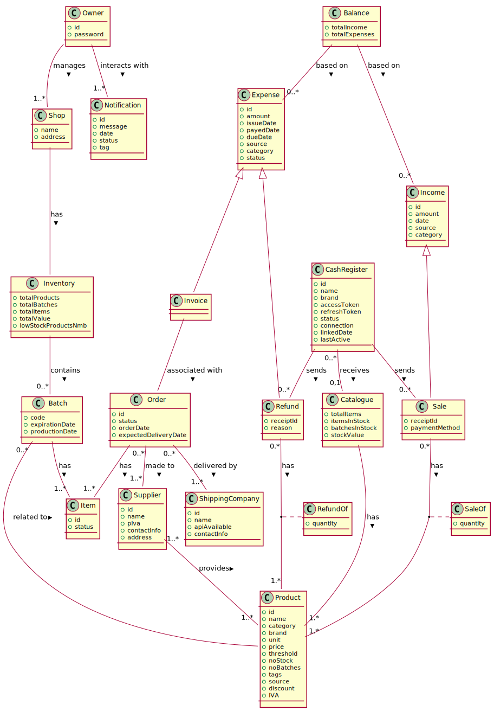
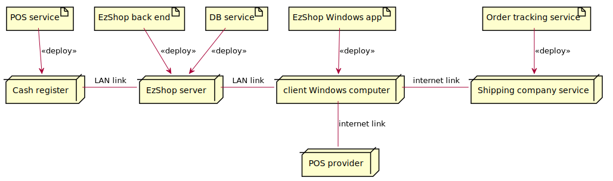

# Requirements Document – EZShop

## Document Status Notice

This document has been developed through a structured, multi-stage process.  
The first few iterations focused on defining the **business model**, identifying all **stakeholders**, and understanding the system’s operational context.

Subsequent revisions progressively introduced the remaining components of the document:

- **Context Diagram and Interfaces** to describe interactions between the system and external actors
- **Functional Requirements (FR)** and **Non-Functional Requirements (NFR)** to describe the system's functions and constraints on its operation
- **Table of Rights** to describe user–system interactions  
- **Use Case Diagram** and complete **Use Case descriptions** to describe the main modes of interaction between the user and the system
- **Glossary** to establish a clear and consistent terminology as well as to highlight the relationships between the different entities listed within
- **System Design** to develop a high-level description of the system's core components
- **Hardware/Software Architecture** to model the interactions between the hardware and software components of the system

The current version represents a **Baseline Requirements Preview** and includes all required artifacts.  
Some prototype-level assumptions have been intentionally left in (e.g., **limited input validation and simplified error-handling logic**) to reflect the early stage of development assumed in this document. A more detailed implementation will be provided during the next stage in the development process. 

---

Date: 23/11/2025  
Version: **0.9 – Baseline Requirements Preview**

### Version History

| Version | Stage | Description |
|:------:|:-----:|-------------|
| 0.1 | Internal Draft | Initial analysis of business model and stakeholder identification |
| 0.2 | Internal Draft |Added Context Diagram|
| 0.3 | Internal Draft | Added first draft of Functional Requirements |
| 0.4 | Alpha | Introduced Non-Functional Requirements; added Table of Rights structure |
| 0.5 | Alpha |Interfaces, and early System Design notes |
| 0.6 | Beta | Completed Functional & Non-Functional Requirements; added Glossary |
| 0.7 | Beta | Added full Use Case Diagram and structured Use Case descriptions with scenarios |
| 0.8 | Release Candidate | Completed System Design and Hardware/Software Architecture; refined all diagrams and cross-references |
| **0.9** | **Baseline Requirements Preview** | Full coverage of all document sections: FR, NFR, Glossary, Use Cases, Interfaces, System Architecture. Considered complete for initial development. |

# Contents

- [Requirements Document – EZShop](#requirements-document--ezshop)
  - [Document Status Notice](#document-status-notice)
    - [Version History](#version-history)
- [Contents](#contents)
- [Informal description](#informal-description)
- [Business Model](#business-model)
- [Stakeholders](#stakeholders)
- [Context Diagram and interfaces](#context-diagram-and-interfaces)
  - [Context Diagram](#context-diagram)
  - [Interfaces](#interfaces)
- [Functional and non functional requirements](#functional-and-non-functional-requirements)
  - [Functional Requirements](#functional-requirements)
  - [Non Functional Requirements](#non-functional-requirements)
- [Table of rights](#table-of-rights)
  - [Use case diagram](#use-case-diagram)
    - [Use case Manage Inventory, UC1](#use-case-manage-inventory-uc1)
      - [Scenario MI1](#scenario-mi1)
        - [Steps](#steps)
      - [Scenario MI2](#scenario-mi2)
        - [Steps](#steps)
      - [Scenario MI3](#scenario-mi3)
        - [Steps](#steps)
      - [Scenario MI1E1](#scenario-mi1e1)
        - [Steps](#steps)
    - [Use case Manage Supplier, UC2](#use-case-manage-supplier-uc2)
      - [Scenario MS1](#scenario-ms1)
        - [Steps](#steps)
      - [Scenario MS2](#scenario-ms2)
        - [Steps](#steps)
      - [Scenario MS3](#scenario-ms3)
        - [Steps](#steps)
      - [Scenario MS1E1](#scenario-ms1e1)
        - [Steps](#steps)
    - [Use case Manage Orders, UC3](#use-case-manage-orders-uc3)
      - [Scenario MO1](#scenario-mo1)
        - [Steps](#steps)
      - [Scenario MO2](#scenario-mo2)
        - [Steps](#steps)
      - [Scenario MO3](#scenario-mo3)
        - [Steps](#steps)
      - [Scenario MO1E1](#scenario-mo1e1)
        - [Steps](#steps)
    - [Use case Manage Invoices, UC4](#use-case-manage-invoices-uc4)
      - [Scenario MV1](#scenario-mv1)
        - [Steps](#steps)
      - [Scenario MV2](#scenario-mv2)
        - [Steps](#steps)
      - [Scenario MV3](#scenario-mv3)
        - [Steps](#steps)
      - [Scenario MV1E1](#scenario-mv1e1)
        - [Steps](#steps)
    - [Use case Authenticate Owner, UC5](#use-case-authenticate-owner-uc5)
      - [Scenario AO1](#scenario-ao1)
        - [Steps](#steps)
      - [Scenario AO1E](#scenario-ao1e)
        - [Steps](#steps)
    - [Use case Change Password, UC6](#use-case-change-password-uc6)
      - [Scenario CP1](#scenario-cp1)
        - [Steps](#steps)
      - [Scenario CP1V1](#scenario-cp1v1)
        - [Steps](#steps)
    - [Use case Manage Product Catalogue, UC7](#use-case-manage-product-catalogue-uc7)
      - [Scenario MP1](#scenario-mp1)
        - [Steps](#steps)
      - [Scenario MP2](#scenario-mp2)
        - [Steps](#steps)
      - [Scenario MP3](#scenario-mp3)
        - [Steps](#steps)
      - [Scenario MP1E1](#scenario-mp1e1)
        - [Steps](#steps)
    - [Use case Receive Notifications, UC8](#use-case-receive-notifications-uc8)
      - [Scenario RN1](#scenario-rn1)
        - [Steps](#steps)
      - [Scenario RN2](#scenario-rn2)
        - [Steps](#steps)
      - [Scenario RN3](#scenario-rn3)
        - [Steps](#steps)
      - [Scenario RN4](#scenario-rn4)
        - [Steps](#steps)
      - [Scenario RN5](#scenario-rn5)
        - [Steps](#steps)
      - [Scenario RN6](#scenario-rn6)
        - [Steps](#steps)
      - [Scenario RN1V1](#scenario-rn1v1)
        - [Steps](#steps)
      - [Scenario RN6V1](#scenario-rn6v1)
        - [Steps](#steps)
    - [Use case Import Data, UC9](#use-case-import-data-uc9)
      - [Scenario ID1](#scenario-id1)
        - [Steps](#steps)
      - [Scenario ID1E1](#scenario-id1e1)
        - [Steps](#steps)
    - [Use case Export Data, UC10](#use-case-export-data-uc10)
      - [Scenario ED1](#scenario-ed1)
        - [Steps](#steps)
      - [Scenario ED1E1](#scenario-ed1e1)
        - [Steps](#steps)
    - [Use case Retrieve Data, UC11](#use-case-retrieve-data-uc11)
      - [Scenario RD1](#scenario-rd1)
        - [Steps](#steps)
      - [Scenario RD2](#scenario-rd2)
        - [Steps](#steps)
      - [Scenario RD1V1](#scenario-rd1v1)
        - [Steps](#steps)
    - [Use case Manage Accounting, UC12](#use-case-manage-accounting-uc12)
      - [Scenario MA1](#scenario-ma1)
        - [Steps](#steps)
      - [Scenario MA2](#scenario-ma2)
        - [Steps](#steps)
      - [Scenario MA3](#scenario-ma3)
        - [Steps](#steps)
    - [Use case Manage Cash Registers, UC13](#use-case-manage-cash-registers-uc13)
      - [Scenario CR1](#scenario-cr1)
        - [Steps](#steps)
      - [Scenario CR2](#scenario-cr2)
        - [Steps](#steps)
      - [Scenario CR3](#scenario-cr3)
        - [Steps](#steps)
      - [Scenario CR1E1](#scenario-cr1e1)
        - [Steps](#steps)
    - [Use case Manage Sales and Refunds, UC14](#use-case-manage-sales-and-refunds-uc14)
      - [Scenario MR1](#scenario-mr1)
        - [Steps](#steps)
      - [Scenario MR2](#scenario-mr2)
        - [Steps](#steps)
      - [Scenario MRE1](#scenario-mre1)
        - [Steps](#steps)
    - [Use case Get Catalogue, UC15](#use-case-get-catalogue-uc15)
      - [Scenario GC1](#scenario-gc1)
        - [Steps](#steps)
      - [Scenario GCE1](#scenario-gce1)
        - [Steps](#steps)
    - [Use case Track Orders, UC16](#use-case-track-orders-uc16)
      - [Scenario TO1](#scenario-to1)
        - [Steps](#steps)
      - [Scenario TO2](#scenario-to2)
        - [Steps](#steps)
      - [Scenario TOE1](#scenario-toe1)
        - [Steps](#steps)
    - [Use case Manage shipping companies, UC17](#use-case-manage-shipping-companies-uc17)
      - [Scenario MC1](#scenario-mc1)
        - [Steps](#steps)
      - [Scenario MC2](#scenario-mc2)
        - [Steps](#steps)
      - [Scenario MC3](#scenario-mc3)
        - [Steps](#steps)
      - [Scenario MC1E1](#scenario-mc1e1)
        - [Steps](#steps)
        - [Scenario 1.1](#scenario-11)
- [Glossary](#glossary)
- [System Design](#system-design)
- [Hardware Software architecture](#hardware-software-architecture)

# Informal description

Small shops require a simple application to support the owner or manager. A small shop (ex a food shop) occupies 50-200 square meters, sells 500-2000 different item types, has two or a few more cash registers. 
EZShop is a software application to:
* manage sales
* manage inventory
* manage orders to suppliers
* support accounting

In the following describe the requirements of the EZShop application. 
You are free to define the application as you deem more useful and effective for the stakeholders. 
You are also free to modify the structure of the document when needed.
The document will be evaluated considering the typical defects in requirements (omissions, ambiguities, contradictions, etc), and syntactic errors in the formalism used (UML diagrams). 
Consider that the document should be delivered to another team (unknown to you)
 which will be in charge of designing and implementing the system. The design team should be able to proceed only with the information in the document.

# Business Model
- Customer segment
    * Small shop owners and managers with poor or limited internet connection or that prefer the reliability and privacy associated with local system 
- Value proposition
    * **Statistical reports**
        + Daily, weekly, monthly reports on sales, refunds, and inventory to help the owner understand the business' performance
        + Fully customizable reports on sales, refunds, catalogue, and batches to help the owner get a clear picture of their business 
        + Graphical reports of the most critical areas, to help the owner focus on what really matters 
    * **Accounting**
        + Real time tracking of incomes, expenses, and current balance to immediatly get a clear picture on how the business is performing
        + Easy tracking of invoices to never lose a payment that's due
    * **Automation**
        + Order's shipment status is automatically tracked so that the owner may keep it off its mind
        + Cash registers' catalogues are automatically updated so that no one has to do it manually to each one of them
        + Sales and refunds are automatically transferred to the application to avoid losing transactions along the way
        + Inventory item quantities and expiration date is automatically tracked to avoid not knowing when a shelf is empty
    * **Decision support**
        + Orders are automatically suggested based on what is currently lacking in the inventory or is close to its expiration date so that no shelf remains unstocked
        + Easily track what was bought when and where so that no order may be lost
    * **Privacy focused**
        + The system requires minimum connectivity with the internet in order to function properly so that the system can be always online when it matters
        + All information is stored securely and locally on owner's provided hardware so that the owner may own its own data
- Revenue Stream
    * **Yearly fee**
        + The application will be subscription-based with a yearly fee to ensure recurring revenue
    * **Privately founded**
        + The application will be developed by a third-party software company, the initial development and ongoing maintenance costs will be funded privately, whereas long terms profit will be ensured by the yearly fee.

> **Business' context** 
>
> In order to make our business model feasible we imagined being part of a third party software development business.
> Our company has been commissioned with the development of a software application, EzShop, that would work along-side Square POS, their existing API and hardware, to offer a "local" and "offline" version of their services. 

# Stakeholders

| Stakeholder name | Description |
| :--------------: | :---------: |
| Shop owner | Reviews accounting information and initiates orders to suppliers |
| Cashier | Handles transactions and enters sales info through the cash register |
| Cash register | Feeds data to the application |
| POS provider | Grants access token to identify and comunicate securely with the cash registers |
| Shipment tracking provider | Grants the ability to retrieve the current order's status|
| Desktop OS| The device where the application resides |
| Product suppliers | Business who supply the shop with items |
| Shipping company | Company who delivers the items to the shop|
| DB service supplier | Stores data |
| Development team | Team responsible for the development of the application |
| Maintenance team | Team responsible for the long term support of the application |
| Competitors | Other companies that sell a similar product |

# Context Diagram and interfaces

## Context Diagram

## Interfaces

|   Actor   | Logical Interface | Physical Interface |
| :-------: | :---------------: | :----------------: |
| Shop manager | GUI | Desktop computer |
| Cash register | Square, lightspeed, nexi or clover API | Lan connection |
| POS provider | Square, lightspeed, nexi or clover API | Internet connection |
| Shipment tracking provider | easy post API | Internet connection |

# Functional and non functional requirements

## Functional Requirements

| ID | Description |
|:--:|:------------|
| FR1 | Manage sales |
| FR1.1 | Create owner-defined sale list |
| FR1.1.1 | For each owner-defined list filter sales by a specified date (ISO 8601) or time window |
| FR1.1.2 | Retrieve sales filtered by products sold |
| FR1.1.3 | Retrieve sales ranked by number of items sold per specific product |
| FR1.1.4 | Retrieve sales ranked by the sum of its item's prices |
| FR1.2 | Manage `.csv` |
| FR1.2.1 | Import sales list from `.csv` |
| FR1.2.1.1 | Detect import errors |
| FR1.2.1.2 | Detect schema mismatch |
| FR1.2.1.3 | Update sales |
| FR1.2.2 | Export list of sales as `.csv` |
| FR1.2.2.1 | Retrieve sales |
| FR1.2.2.2 | Create `.csv` file |
| FR1.2.2.3 | Detect export errors |
| FR2 | Manage refunds |
| FR2.1 | Create owner-defined refund list |
| FR2.1.1 | For each owner-defined list filter refunds by a specified date (ISO 8601) or time window |
| FR2.1.2 | Retrieve refunds filtered by products returned |
| FR2.1.3 | Retrieve refunds ranked by number of items given back per specific product |
| FR2.1.4 | Retrieve refunds ranked by the sum of its item's prices |
| FR2.2 | Manage `.csv` |
| FR2.2.1 | Import refunds list from `.csv`|
| FR2.2.1.1 | Detect import errors |
| FR2.2.1.2 | Detect schema mismatch |
| FR2.2.1.3 | Update refunds |
| FR2.2.2 | Export list of refunds as `.csv`|
| FR2.2.2.1 | Retrieve refunds |
| FR2.2.2.2 | Create `.csv` file |
| FR2.2.2.3 | Detect export errors |
| FR3 | Manage catalogue |
| FR3.1 | Manage CRUD operations |
| FR3.1.1 | Create new product in the catalogue |
| FR3.1.2 | Update product from the catalogue |
| FR3.1.3 | Delete product from the catalogue |
| FR3.2 | Set product item quantity warning threshold |
| FR3.3 | Create owner-defined product list |
| FR3.3.1 | Retrieve list of products filtered by one or more of their attributes |
| FR3.3.2 | Retrieve number of items available for a selected product |
| FR3.4 | Manage `.csv` |
| FR3.4.1 | Import products list from `.csv` |
| FR3.4.1.1 | Detect import errors |
| FR3.4.1.2 | Detect schema mismatch |
| FR3.4.1.3 | Update products list |
| FR3.4.2 | Export list of products as `.csv` |
| FR3.4.2.1 | Retrieve products list |
| FR3.4.2.2 | Create `.csv` file |
| FR3.4.2.3 | Detect export errors |
| FR4 | Manage inventory |
| FR4.1 | Manage CRUD operations |
| FR4.1.1 | Create new batch in the inventory |
| FR4.1.2 | Update batch from the inventory |
| FR4.1.3 | Delete batch from the inventory |
| FR4.2 | Create owner-defined batch list |
| FR4.2.1 | Retrieve batches filtered by one or more product/batch attributes |
| FR4.3 | Manage `.csv` |
| FR4.3.1 | Import batches list from `.csv` |
| FR4.3.1.1 | Detect import errors |
| FR4.3.1.2 | Detect schema mismatch |
| FR4.3.1.3 | Update inventory |
| FR4.3.2 | Export list of batches as `.csv` |
| FR4.3.2.1 | Retrieve batches list |
| FR4.3.2.2 | Create `.csv` file |
| FR4.3.2.3 | Detect export errors |
| FR5 | Manage invoices |
| FR5.1 | Manage CRUD operations |
| FR5.1.1 | Create new invoice |
| FR5.1.2 | Update invoice |
| FR5.1.3 | Delete invoice |
| FR5.1.4 | Link invoice to a specific order |
| FR5.2 | Create owner-defined invoice list |
| FR5.2.1 | Retrieve list of invoices filtered by one or more of their attributes |
| FR5.3 | Manage `.csv` |
| FR5.3.1 | Import invoices list from `.csv` |
| FR5.3.1.1 | Detect import errors |
| FR5.3.1.2 | Detect schema mismatch |
| FR5.3.1.3 | Update invoices |
| FR5.3.2 | Export list of invoices as `.csv` |
| FR5.3.2.1 | Retrieve invoices |
| FR5.3.2.2 | Create `.csv` file |
| FR5.3.2.3 | Detect export errors |
| FR6 | Manage suppliers |
| FR6.1 | Manage CRUD operations |
| FR6.1.1 | Create new supplier |
| FR6.1.2 | Update supplier |
| FR6.1.3 | Delete supplier |
| FR6.1.4 | Link supplier to one or more products |
| FR6.1.5 | Unlink supplier from one or more products |
| FR6.1.6 | Link supplier to one or more batches |
| FR6.1.7 | Unlink supplier from one or more batches |
| FR6.2 | Create owner-defined supplier list |
| FR6.2.1 | Retrieve suppliers list filtered by one or more product they provide |
| FR6.2.2 | Retrieve suppliers list ranked by number of associated purchase orders |
| FR6.3 | Manage `.csv` |
| FR6.3.1 | Import supplier list from `.csv` |
| FR6.3.1.1 | Detect import errors |
| FR6.3.1.2 | Detect schema mismatch |
| FR6.3.1.3 | Update suppliers |
| FR6.3.2 | Export list of suppliers as `.csv` |
| FR6.3.2.1 | Retrieve suppliers |
| FR6.3.2.2 | Create `.csv` file |
| FR6.3.2.3 | Detect export errors |
| FR7 | Manage Shipping companies |
| FR7.1 | Manage CRUD operations |
| FR7.1.1 | Create new shipping company |
| FR7.1.2 | Update shipping company |
| FR7.1.3 | Delete shipping company |
| FR7.1.4 | Link shipping company to one or more orders |
| FR7.1.5 | Unlink shipping company from one or more orders |
| FR7.2 | Create owner-defined shipping companies list |
| FR7.2.1 | Retrieve shipping companies list filtered by one or more of their attributes |
| FR7.2.2 | Retrieve shipping companies list ranked by number of associated shipments with a selected status |
| FR7.3 | Manage `.csv` |
| FR7.3.1 | Import shipping companies list from `.csv` |
| FR7.3.1.1 | Detect import errors |
| FR7.3.1.2 | Detect schema mismatch |
| FR7.3.1.3 | Update shipping companies list |
| FR7.3.2 | Export list of shipping companies as `.csv` |
| FR7.3.2.1 | Retrieve shipping companies list |
| FR7.3.2.2 | Create `.csv` file |
| FR7.3.2.3 | Detect export errors |
| FR8 | Track order |
| FR8.1 | Link with easy post account |
| FR8.1.1 | Redirect user to authorization URL |
| FR8.1.2 | Retrieve access and refresh tokens |
| FR8.1.3 | Store access and refresh tokens securely |
| FR8.1.4 | Retrieve new token when expired |
| FR8.2 | Retrieve shipment status |
| FR8.2.1 | Retrieve tracking updates from provider API |
| FR8.2.2 | Update order's status accordingly |
| FR9 | Manage orders |
| FR9.1 | Manage CRUD operations |
| FR9.1.1 | Create new order |
| FR9.1.2 | Update order |
| FR9.1.3 | Delete order |
| FR9.1.4 | Link order to a supplier |
| FR9.1.5 | Unlink order from a supplier |
| FR9.2 | Create owner-defined orders list |
| FR9.2.1 | Retrieve list of orders filtered by one or more attributes |
| FR9.3 | Manage `.csv` |
| FR9.3.1 | Import orders list from `.csv` |
| FR9.3.1.1 | Detect import errors |
| FR9.3.1.2 | Detect schema mismatch |
| FR9.3.1.3 | Update orders |
| FR9.3.2 | Export list of orders as `.csv` |
| FR9.3.2.1 | Retrieve orders |
| FR9.3.2.2 | Create `.csv` file |
| FR9.3.2.3 | Detect export errors |
| FR9.4 | Suggest order |
| FR9.4.1 | Retrieve products with item count below threshold |
| FR9.4.2 | Retrieve possible supplier for products with item count below threshold |
| FR9.4.3 | Generate order suggestion |
| FR9.4.4 | Add suggested order to the list of orders |
| FR9.4.5 | Detect batches past the expiration date  |
| FR9.4.5 | Detect batches within N days from the expiration date  |
| FR10 | Manage accounting |
| FR10.1 | Track incomes |
| FR10.1.1 | Compute incoming cash flow at different time granularities |
| FR10.1.2 | Retrieve incoming cash flow at different time granularities |
| FR10.2 | Manage incomes `.csv` |
| FR10.2.1 | Import incomes list from `.csv` |
| FR10.2.1.1 | Detect import errors |
| FR10.2.1.2 | Detect schema mismatch |
| FR10.2.1.3 | Update incomes |
| FR10.2.2 | Export list of incomes as `.csv` |
| FR10.2.2.1 | Retrieve incomes |
| FR10.2.2.2 | Create `.csv` file |
| FR10.2.2.3 | Detect export errors |
| FR10.3 | Track expenses |
| FR10.3.1 | Compute outgoing cash flow at different time granularities |
| FR10.3.2 | Retrieve outgoing cash flow at different time granularities |
| FR10.4 | Manage expenses `.csv` |
| FR10.4.1 | Import expenses list from `.csv` |
| FR10.4.1.1 | Detect import errors |
| FR10.4.1.2 | Detect schema mismatch |
| FR10.4.1.3 | Update expenses |
| FR10.4.2 | Export list of expenses as `.csv` |
| FR10.4.2.1 | Retrieve expenses |
| FR10.4.2.2 | Create `.csv` file |
| FR10.4.2.3 | Detect export errors |
| FR10.5 | Track balance |
| FR10.5.1 | Compute total balance at different time granularities |
| FR10.5.2 | Retrieve balance at different time granularities |
| FR10.5.3 | Retrieve current balance |
| FR11 | Authenticate owner |
| FR11.1 | Set password |
| FR11.2 | Change password |
| FR11.3 | Verify password |
| FR11.4 | Encrypt password |
| FR12 | Manage notifications |
| FR12.1 | Create notification |
| FR12.2 | Change notification's status |
| FR12.3 | Delete notification |
| FR13 | Manage cash registers |
| FR13.1 | Link with POS provider’s account |
| FR13.1.1 | Redirect user to authorization URL |
| FR13.1.2 | Save cash register attributes |
| FR13.1.3 | Store tokens securely |
| FR13.1.4 | Validate token with provider |  
| FR13.1.5 | Delete Cash Register |
| FR13.2 | Get cash register list |
| FR13.2.1 | Retrieve list of cash registers |
| FR13.2.2 | Update local list of cash registers |
| FR13.3 | Sync catalogue |
| FR13.3.1 | Convert catalogue to provider format |
| FR13.3.2 | Push new catalogue to cash registers |
| FR13.3.3 | Detect unresponsive cash registers and update status |
| FR13.4 | Retrieve sales |
| FR13.4.1 | Retrieve sales list from cash register |
| FR13.4.2 | Update inventory quantities |
| FR13.4.3 | Add sale to sales list |
| FR13.4.4 | Detect unresponsive cash registers |
| FR13.5 | Retrieve refunds |
| FR13.5.1 | Retrieve refunds list from cash register |
| FR13.5.2 | Update item quantities |
| FR13.5.3 | Add refund to refunds list |
| FR13.5.4 | Detect unresponsive cash registers |
| FR13.6 | Create owner-defined cash register list |
| FR13.6.1 | Retrieve cash registers filtered by attributes |
| FR13.6.2 | Retrieve cash registers grouped by provider brand |
| FR14 | Manage Internet Connection |
| FR 14.1 | Detect loss of internet connectivity |

## Non Functional Requirements

| ID   | Type          | Description | Refers to |
|------|---------------|-------------|-----------|
| NFR1 | Functionality | **Suitability** • All owner needs identified in the use cases should map to at least one functional requirement  **Accuracy** • Catalogue updates, order-status updates, sales, refunds and similar synchronization operations must achieve a guaranteed delivery rate greater than 99.999 % • Exported `.csv` files should have less than 1 mistaken row every 100'000 • Importing `.csv` files should generate less than 1 mistaken row every 100'000 • CRUD operations should have less than 1 error every 100'000 operations • Notification should fail to trigger less than 1 every 100'000 expected notifications • Order status should fail to update properly less than 1 time every 100'000 updates  **Interoperability** • The application should use the square API to pull/push data to square POS • The application should use the easy post API to interact with shipping companies and automatically track order status • All functions that may access data concurrently, must be thread-safe  **Security** • Passwords must be encrypted using AES-256 • The application must pass Gitlab SATS without high severity issues (CSVV > 7) being highlighted | FR1–FR14 |
| NFR2 | Reliability | **Maturity** • The application should crash less than 1 time every 200 hours of operation • The application should suffer less than 1 minor visual glitch (solved by changing/refreshing the current tab) every 50 hours of operation  **Fault Tolerance** • The application should not crash when Importing `.csv` files without the right format • The application should be able to perform all its operations, beside syncing with cash registers and shipping companies, even without an internet connection • The application should be able to work without crashing even when data read from the cash registers is corrupted, malformed or absent • The application should be able to work without crashing even when data read from the shipping companies' APIs is corrupted, malformed or absent • The application should queue failed API calls and retry every 5 minutes • All multi-steps functions must be atomic; partial updates should be rolled back or notified to the owner | FR1.2, FR2.2, FR3.4, FR4.3, FR5.3, FR6.3, FR7.3, FR9.3, FR10.2, FR10.4, FR8, FR13, FR14 |
| NFR3 | Usability | **Understandability** • The application should display tooltips when hovering over buttons which can be pressed • The application should use consistent design elements and language • The application should follow industry standard practices and conventions • All GUI elements should have a contrast rating greater than 4.5  **Learnability** • A user with low to moderate digital literacy should be able to learn how to: – navigate the main interface within 5 minutes – correctly import a `.csv` file within 10 minutes – modify how the data is displayed within 10 minutes – add a new product, batch, order, invoice, supplier, shipping company or cash register within 30 minutes  **Operability** • All CRUD operations should be accessible within 2 clicks • The GUI should be able to respond to user input within 500 ms  **Usability compliance** • The application should follow WCAG guidelines | FR1–FR7, FR9, FR10, FR11, FR12, FR13 |
| NFR4 | Efficiency | **Time Behavior** • All CRUD operations operating on single entities should be completed within 1000 ms • Retrieving ≈ 100 MB of data filtered, sorted or ranked by a specific set of rules should be completed within 10'000 ms • Importing and exporting `.csv` files should take within 10'000 ms every 1000 rows • Order status for supported suppliers should be updated within 3 h from the actual reported change • Sales and refunds should be updated at least every 2 minutes • Catalogue updates should be propagated to all cash registers every day at 6.00 a.m. • Startup time should be within 5'000 ms  **Resource Utilization** • The application should use no more than 500 MB of disk storage space (excluding data such as orders, sales, refunds, ...) • The application should use no more than 2 GB of RAM memory under expected load • The application should use no more than 50 % of the available CPU resources under normal load on tested hardware (Intel Core i5-8000 or i5-9000 series, 8 G of RAM) | FR1.1, FR2.1, FR3.3, FR4.2, FR5.2, FR6.2, FR7.2, FR9.2, FR1.2, FR2.2, FR3.4, FR4.3, FR5.3, FR6.3, FR7.3, FR9.3, FR10.2, FR10.4, FR8, FR13, FR9.4 |
| NFR5 | Maintainability | **Analyzability** • 95 % of code functions should be documented • New functions should be documented within 1 week • Mean time to diagnose a defect should be within 1 day • All API errors, sync errors, and critical errors must be logged and persisted  **Changeability** • Mean time to implement a minor feature should be within 1 working week • Mean time to implement major features should be within 1 months • The cyclomatic complexity of functions should be on average less than 15; no single function should exceed a cyclomatic complexity of 20  **Stability** • A new release should introduce less than 1 regression defect  **Testability** • Unit tests should cover 90 % of the codebase • Integration tests should cover 80 % of the codebase | FR1–FR14 |
| NFR6 | Portability | **Adaptability** • The application should run on Windows 10 and 11 without code modification  **Installability** • The application should complete installation within 10 minutes on tested hardware • The application should complete installation with a success rate greater than 95 % on tested hardware (Intel Core i5-8000 or i5-9000 series, 8 G of RAM)  **Co-existence** • The application should be able to run alongside the common antivirus applications (Windows Defender, Avast, McAfee, Norton, BitDefender, Kaspersky, AVG, ESET, Trend Micro, Sophos) without conflicts • The application should be able to perform its functionalities without requiring exclusive system resources access • The application should be able to work alongside firewalls  **Interoperability** • Future version of the EzShop application should be able to import data in `.csv` format exported from previous version of the application | FR1–FR14 |

# Table of rights

|  Actor   | FR1         | FRx |
| user     |             | :---: |
|          |             |       |

# Use case diagram and use cases

| **UC Name**                        | **Goal**                                   | **Description**|
| ---------------------------------- | ----------------------------------------- | ------------------------------------------------------------------------------------------------- |
| **UC1 – Manage Inventory**         | Track products                              | Owner creates, updates and deletes batches of products| 
| **UC2 - Manage Supplier**          | Manage supplier                             | Owner creates, updates and deletes supplier |  
| **UC3 – Manage Orders**            | Manage supplier orders                      | Owner creates, updates, and deletes orders |
| **UC4 – Manage Invoices**          | Record and manage invoices                  | Owner creates, updates and deletes invoices |
| **UC5 – Authenticate Owner**       | Ensure secure access                        | Owner authenticates through a password |
| **UC6 - Change password**          | Change the password                         | Owner change system's password |
| **UC7 – Manage Product Catalogue** | Manage the product catalogue                | Owner creates, updates, and deletes products of the catalogue |
| **UC8 – Receive Notifications**    | Notify the user of relevant events          | The system sends notifications related to product expirations, ongoing orders, status changes, or orders' suggestions|
| **UC9 - Import Data**              | Import data as .csv                         | Owner imports products, sales, batches, shipping companies or order lists as .csv | 
| **UC10 - Export Data**              | Export data as .csv                         | Owner exports products, sales, batches, shipping companies or order lists as .csv |
| **UC11 - Retrieve Data**           | Retrieve data required  by the owner        | Owner retrieves list of products, sales, orders, batches, refunds, cash registers, shipping companies and invoices filtered by one or more fo their attributes |
| **UC12 - Manage accounting**        | Retrieve incomes, expenses and balance     | Owner retrieves incomes, outogings and balance tracked and computed by the system|     
| **UC13 - Manage cash registers**   | Add cash registers to the system            | Owner connect cash registers to the system throug\h POS API |
| **UC14 – Manage Sales and Refunds**      | Send sales and refunds                      | The system sends api polling every 2 minutes asking to cash registers to send their stored sales and refunds |
| **UC15 - Get Catalogue**           | Get catalogue from system                   | The system sends api polling every day at 6.00 a.m. to update the cash register's internal catalogue |
| **UC16 - Track Orders** |   Get the current status of one or more orders        | The system ask to the shipping company tracking service via api the current status of the order and gets it |
| **UC17 - Manage shipping companies** |Manage shipping companies                   |  Owner creates, updates and deletes shipping companies |

## Use case diagram

### Use case Manage Inventory, UC1 

| Actors Involved  |                 Owner                                                |
| :--------------: | :------------------------------------------------------------------ |
|  Precondition   | Owner is authenticated && DB services are available    |
|  Post condition  | CRUD-type batches of products's operation is performed |
| Nominal Scenario | - Owner creates a batches of products MI1   - Owner updates a batches of products MI2   - Owner deletes a batches of products MI3| 
|     Exception    | - Owner tries to create a batches of products that is alredy in the system MI1E1   |

#### Scenario MI1

|  Scenario MI1  |                                                                            |
| :------------: | :------------------------------------------------------------------------: |
| Precondition   | Owner is authenticated && DB services are available                        |
| Post condition | A new batch is inserted in the inventory                                   |

##### Steps

| Actor's Action                                  | System Action                                                      | FR needed |
|--------------------------------------------------|--------------------------------------------------------------------|-----------|
| Owner requests to create a new batch             | System opens a data-entry dialog requesting batch parameters       |FR4.1.1      |
| Owner enters batch parameters                    |                                                                    |FR4.1.1      |
|                                                  | System checks if a batch with the same identifying values exists   | FR4.1.1     |
|                                                  | System creates and inserts a new batch in the DB using the parameters |FR4.1.1   |
                                        

#### Scenario MI2 

|  Scenario MI2  |                                                                            |
| :------------: | :------------------------------------------------------------------------: |
| Precondition   | Owner is authenticated && DB services are available                                         |
| Post condition | The selected batch is updated in the inventory                              |

##### Steps

| Actor's Action                                  | System Action                                                      | FR needed |
|--------------------------------------------------|--------------------------------------------------------------------|-----------|
| Owner requests to update a batch                 | System opens a data-entry dialog requesting updated parameters     | FR4.1.2          |
| Owner modifies batch parameters                  |                                                                    |   FR4.1.2        |
|                                                  | System updates the batch in the DB using the new parameters        |    FR4.1.2       |

#### Scenario MI3 

|  Scenario MI3  |                                                                            |
| :------------: | :------------------------------------------------------------------------: |
| Precondition   | Owner is authenticated && DB services are available                                         |
| Post condition | The batch is deleted from the inventory                                     |

##### Steps

| Actor's Action                                  | System Action                                                      | FR needed |
|--------------------------------------------------|--------------------------------------------------------------------|-----------|
| Owner requests to delete a batch                 |                                                                    |     FR4.1.3      |
|                                                  | System deletes the batch from the DB                               |       FR4.1.3    |

#### Scenario MI1E1

|  Scenario MI1E1 |                                                                            |
| :-------------: | :------------------------------------------------------------------------: |
| Precondition    | Owner is authenticated && DB services are available                        |
| Post condition  | No new batch is created          |

##### Steps

| Actor's Action                                  | System Action                                                      | FR needed |
|--------------------------------------------------|--------------------------------------------------------------------|-----------|
| Owner requests to create a new batch             | System opens a data-entry dialog requesting batch parameters       |   FR4.1.1        |
| Owner enters batch parameters                    |                                                                    |    FR4.1.1       |
|                                                  | System checks if a batch with the same identifying values exists   |     FR4.1.1      |
|                                                  | System detects the batch already exists                            |     FR4.1.1      |
|                                                  | System rejects the creation and displays an error message          |      FR4.1.1     |

### Use case Manage Supplier, UC2 

| Actors Involved  |                 Owner                                                |
| :--------------: | :------------------------------------------------------------------ |
|  Precondition   | Owner is authenticated && DB services are available    |
|  Post condition  | CRUD-type suppliers's operation is performed |
| Nominal Scenario | - Owner creates a supplier MS1   - Owner updates a supplier MS2   - Owner deletes a supplier MS3|  
|     Exception    | - Owner tries to create a supplier that is alredy in the system MS1E1   |

#### Scenario MS1  

|  Scenario MS1  |                                                                            |
| :------------: | :------------------------------------------------------------------------: |
| Precondition   | Owner is authenticated && DB services are available                        |
| Post condition | A new supplier is inserted in the system                                    |

##### Steps

| Actor's Action                        | System Action                                                       | FR needed |
|----------------------------------------|---------------------------------------------------------------------|-----------|
| Owner requests to create a new supplier| System opens a data-entry dialog requesting supplier parameters     |    FR6.1.1  |
| Owner inserts supplier parameters      |                                                                     |     FR6.1.1      |
|                                        | System checks if supplier already exists in the DB                  |       FR6.1.1    |
|                                        | System creates and inserts a new supplier in the DB                 |        FR6.1.1   |

#### Scenario MS2 

|  Scenario MS2  |                                                                            |
| :------------: | :------------------------------------------------------------------------: |
| Precondition   | Owner is authenticated && DB services are available                                      |
| Post condition | The selected supplier is updated in the system                             |

##### Steps

| Actor's Action                        | System Action                                                       | FR needed |
|----------------------------------------|---------------------------------------------------------------------|-----------|
| Owner requests to update a supplier    | System opens a data-entry dialog requesting new parameters          |      FR6.1.2     |
| Owner modifies supplier parameters     |                                                                     |       FR6.1.2    |
|                                        | System updates the supplier in the DB using the new parameters      |        FR6.1.2   |

#### Scenario MS3 

|  Scenario MS3  |                                                                            |
| :------------: | :------------------------------------------------------------------------: |
| Precondition   | Owner is authenticated && DB services are available                                      |
| Post condition | The supplier is deleted from the system                                     |

##### Steps

| Actor's Action                        | System Action                                                       | FR needed |
|----------------------------------------|---------------------------------------------------------------------|-----------|
| Owner requests to delete a supplier    |                                                                     |      FR6.1.3     |
|                                        | System deletes the supplier from the DB                             |        FR6.1.3   |

#### Scenario MS1E1

|  Scenario MS1E1 |                                                                            |
| :-------------: | :------------------------------------------------------------------------: |
| Precondition    | Owner is authenticated && DB services are available                        |
| Post condition  | No new supplier is created |

##### Steps

| Actor's Action                        | System Action                                                       | FR needed |
|----------------------------------------|---------------------------------------------------------------------|-----------|
| Owner requests to create a new supplier| System opens a data-entry dialog requesting supplier parameters     |      FR6.1.1     |
| Owner inserts supplier parameters      |                                                                     |        FR6.1.1   |
|                                        | System checks if supplier already exists in the DB                  |        FR6.1.1   |
|                                        | System detects duplication                                           |        FR6.1.1   |
|                                        | System rejects the creation and displays an error message            |        FR6.1.1   |

### Use case Manage Orders, UC3

| Actors Involved  |                 Owner                                                |
| :--------------: | :------------------------------------------------------------------ |
|  Precondition   | Owner is authenticated && DB services are available    |
|  Post condition  | CRUD-type order's operation is performed |
| Nominal Scenario | - Owner creates a order MO1   - Owner updates a order MO2   - Owner deletes a order MO3| 
|     Exception    | - Owner tries to create an order that is alredy in the system MO1E1   |

#### Scenario MO1  

|  Scenario MO1  |                                                                            |
| :------------: | :------------------------------------------------------------------------: |
| Precondition   | Owner is authenticated && DB services are available                        |
| Post condition | A new order is inserted in the inventory                                   |

##### Steps

| Actor's Action                        | System Action                                                       | FR needed |
|----------------------------------------|---------------------------------------------------------------------|-----------|
| Owner requests to create a new order   | System opens a data-entry dialog requesting order parameters        |     FR9.1.1      |
| Owner inserts order parameters         |                                                                     |      FR9.1.1     |
|                                        | System checks if the order already exists in the DB                |        FR9.1.1   |
|                                        | System creates and inserts a new order in the DB                   |       FR9.1.1    |

#### Scenario MO2 

|  Scenario MO2  |                                                                            |
| :------------: | :------------------------------------------------------------------------: |
| Precondition   | Owner is authenticated && DB services are available                                        |
| Post condition | The selected order is updated in the inventory                             |

##### Steps

| Actor's Action                        | System Action                                                       | FR needed |
|----------------------------------------|---------------------------------------------------------------------|-----------|
| Owner requests to update an order      | System opens a data-entry dialog requesting updated parameters      |    FR9.1.2       |
| Owner modifies the order parameters    |                                                                     |      FR9.1.2     |
|                                        | System updates the order in the DB using the new parameters         |        FR9.1.2   |

#### Scenario MO3 

|  Scenario MO3  |                                                                            |
| :------------: | :------------------------------------------------------------------------: |
| Precondition   | Owner is authenticated && DB services are available                                      |
| Post condition | The order is deleted from the inventory                                     |

##### Steps

| Actor's Action                        | System Action                                                       | FR needed |
|----------------------------------------|---------------------------------------------------------------------|-----------|
| Owner requests to delete the order     |                                                                     |     FR9.1.3      |
|                                        | System deletes the order from the DB                                |       FR9.1.3    |

#### Scenario MO1E1

|  Scenario MO1E1 |                                                                            |
| :-------------: | :------------------------------------------------------------------------: |
| Precondition    | Owner is authenticated && DB services are available                        |
| Post condition  | No new order is created    |

##### Steps

| Actor's Action                        | System Action                                                       | FR needed |
|----------------------------------------|---------------------------------------------------------------------|-----------|
| Owner requests to create a new order   | System opens a data-entry dialog requesting order parameters        |     FR9.1.1      |
| Owner inserts order parameters         |                                                                     |       FR9.1.1    |
|                                        | System checks if the order already exists in the DB                |        FR9.1.1   |
|                                        | System detects duplication                                           |       FR9.1.1    |
|                                        | System rejects the creation and displays an error message           |       FR9.1.1    |

### Use case Manage Invoices, UC4

| Actors Involved  |                 Owner                                                |
| :--------------: | :------------------------------------------------------------------ |
|  Precondition   | Owner is authenticated && DB services are available && internet connection is available |
|  Post condition  | CRUD-type invoice's operation is performed |
| Nominal Scenario | - Owner creates a invoice MV1   - Owner updates a invoice MV2   - Owner deletes a invoice MV3| 
|     Exception    | - Owner tries to create an invoice that is alredy in the system MV1E1   |

#### Scenario MV1  

|  Scenario MI1  |                                                                            |
| :------------: | :------------------------------------------------------------------------: |
| Precondition   | Owner is authenticated && DB services are available                        |
| Post condition | A new invoice is inserted in the inventory                                 |

##### Steps

| Actor's Action                          | System Action                                                       | FR needed |
|------------------------------------------|---------------------------------------------------------------------|-----------|
| Owner requests to create a new invoice   | System opens a data-entry dialog requesting invoice parameters      |    FR5.1.1       |
| Owner inserts invoice parameters         |                                                                     |      FR5.1.1     |
|                                          | System checks if the invoice already exists in the DB               |       FR5.1.1    |
|                                          | System creates and inserts a new invoice in the DB                  |        FR5.1.1   |

#### Scenario MV2 

|  Scenario MV2  |                                                                            |
| :------------: | :------------------------------------------------------------------------: |
| Precondition   | Owner is authenticated && DB services are available                                       |
| Post condition | The selected invoice is updated in the system                               |

##### Steps

| Actor's Action                          | System Action                                                       | FR needed |
|------------------------------------------|---------------------------------------------------------------------|-----------|
| Owner requests to update an invoice      | System opens a data-entry dialog requesting updated parameters      |    FR5.1.2       |
| Owner modifies the invoice parameters    |                                                                     |      FR5.1.2     |
|                                          | System updates the invoice in the DB using the new parameters       |        FR5.1.2   |

#### Scenario MV3 

|  Scenario MV3  |                                                                            |
| :------------: | :------------------------------------------------------------------------: |
| Precondition   |  Owner is authenticated && DB services are available                                        |
| Post condition | The invoice is deleted from the system                                      |

##### Steps

| Actor's Action                          | System Action                                                       | FR needed |
|------------------------------------------|---------------------------------------------------------------------|-----------|
| Owner requests to delete an invoice      |                                                                     |     FR5.1.3      |
|                                          | System deletes the invoice from the DB                               |      FR5.1.3     |

#### Scenario MV1E1

|  Scenario MV1E1 |                                                                            |
| :-------------: | :------------------------------------------------------------------------: |
| Precondition    | Owner is authenticated && DB services are available                        |
| Post condition  | No new invoice is created; system notifies that the invoice already exists |

##### Steps

| Actor's Action                          | System Action                                                       | FR needed |
|------------------------------------------|---------------------------------------------------------------------|-----------|
| Owner requests to create a new invoice   | System opens a data-entry dialog requesting invoice parameters      |    FR5.1.1       |
| Owner inserts invoice parameters         |                                                                     |     FR5.1.1      |
|                                          | System checks if the invoice already exists in the DB               |      FR5.1.1     |
|                                          | System detects duplication                                           |      FR5.1.1     |
|                                          | System rejects creation and displays an error message               |        FR5.1.1   |

### Use case Authenticate Owner, UC5

| Actors Involved  |                 Owner                                                |
| :--------------: | :------------------------------------------------------------------ |
|  Precondition   |  Owner knows a password          |
|  Post condition  |  Owner is correctly authenticated |
| Nominal Scenario | - Authenticate owner AO1   | 
|     Exception    | - Owner tries to authenticate with a wrong password   AOE1    | 

#### Scenario AO1  

|  Scenario AO1  |                                                                            |
| :------------: | :------------------------------------------------------------------------: |
| Precondition   | Owner knows the correct password                                           |
| Post condition | Owner is correctly authenticated                                            |

##### Steps

| Actor's Action                       | System Action                                                       | FR needed |
|---------------------------------------|---------------------------------------------------------------------|-----------|
|                                       | System asks the Owner to insert the password (data-entry dialog)    |      FR11.3     |
| Owner inserts the password            |                                                                     |        FR11.3   |
|                                       | System checks the password                                          |        FR11.3   |
|                                       | System authenticates the Owner                                      |        FR11.3   |

#### Scenario AO1E 

|  Scenario AOE1 |                                                                            |
| :------------: | :------------------------------------------------------------------------: |
| Precondition   | Owner knows an incorrect password                                           |
| Post condition | Owner is not authenticated                                                  |

##### Steps

| Actor's Action                       | System Action                                                       | FR needed |
|---------------------------------------|---------------------------------------------------------------------|-----------|
| —                                     | System asks the Owner to insert the password (data-entry dialog)    |    FR11.1       |
| Owner inserts the password            |                                                                     |    FR11.1       |
|                                       | System checks the password                                          |      FR11.3     |
|                                       | System informs the Owner that the password is incorrect             |        FR11.3   |
|                                       | System does **not** authenticate the Owner                          |         FR11.3  |

### Use case Change Password, UC6

| Actors Involved  |                 Owner                                                |
| :--------------: | :------------------------------------------------------------------  |
|  Pre condition   |  Owner  is authenticated                                             |  
|  Post condition  |  Owner set a new password                                            |
| Nominal Scenario | - Authenticate owner CP1                                          |  
|     Variants    | - Owner set password for the first time CP1V1            | 

#### Scenario CP1

|  Scenario CP1  |                                                                            |
| :------------: | :------------------------------------------------------------------------: |
| Precondition   | Owner is authenticated                                                     |
| Post condition | Owner sets a new valid password                                            |

##### Steps

| Actor's Action                       | System Action                                                       | FR needed |
|---------------------------------------|---------------------------------------------------------------------|-----------|
| Owner requests to change password     | System opens a data-entry dialog                                    |    FR11.2       |
| Owner inserts the new password        |                                                                     |      FR11.2     |
|                                       | System changes the password                                         |        FR11.2   |

#### Scenario CP1V1

|  Scenario CP1V1 |                                                                            |
| :-------------: | :------------------------------------------------------------------------: |
| Precondition    | Owner doesn't have a password                                             |
| Post condition  | A new password is set                                                    |

##### Steps

| Actor's Action                       | System Action                                                       | FR needed |
|---------------------------------------|---------------------------------------------------------------------|-----------|
| Owner requests to set password     | System opens a data-entry dialog                                    |     FR11.1      |
| Owner inserts the new (invalid) password |                                                                   |      FR11.1     |
|                                       | System sets the password                             |        FR11.1   |

### Use case Manage Product Catalogue, UC7

| Actors Involved  |                 Owner                                                |
| :--------------: | :------------------------------------------------------------------ |
|  Precondition   | Owner is authenticated && DB services are available && internet connection is available |
|  Post condition  | CRUD-type operation is performed in the catalogue  |
| Nominal Scenario | - Owner creates a product MP1   - Owner updates a product MP2   - Owner deletes a product MP3| 
|     Exception    | - Owner tries to create a product that is alredy in the system MP1E1   |

#### Scenario MP1  

|  Scenario MP1  |                                                                            |
| :------------: | :------------------------------------------------------------------------: |
| Precondition   | Owner is authenticated && DB services are available                        |
| Post condition | A new product is inserted in the catalogue                                 |

##### Steps

| Actor's Action                          | System Action                                                       | FR needed |
|------------------------------------------|---------------------------------------------------------------------|-----------|
| Owner requests to create a new product   | System opens a data-entry dialog requesting product parameters      |    FR3.1.1       |
| Owner inserts product parameters         |                                                                     |      FR3.1.1     |
|                                          | System checks if the product already exists in the DB               |        FR3.1.1   |
|                                          | System creates and inserts a new product in the DB                  |         FR3.1.1  |
                                                   

#### Scenario MP2 

|  Scenario MP2  |                                                                            |
| :------------: | :------------------------------------------------------------------------: |
| Precondition   | Owner is authenticated && DB services are available                                      |
| Post condition | The selected product is updated in the catalogue                           |

##### Steps

| Actor's Action                          | System Action                                                       | FR needed |
|------------------------------------------|---------------------------------------------------------------------|-----------|
| Owner requests to update a product       | System opens a data-entry dialog requesting updated parameters      |     FR3.1.2      |
| Owner modifies the product parameters    |                                                                     |       FR3.1.2    |
|                                          | System updates the product in the DB using the new parameters       |        FR3.1.2   |

#### Scenario MP3 

|  Scenario MP3  |                                                                            |
| :------------: | :------------------------------------------------------------------------: |
| Precondition   | Owner is authenticated && DB services are available                                      |
| Post condition | The product is deleted from the catalogue                                  |

##### Steps

| Actor's Action                          | System Action                                                       | FR needed |
|------------------------------------------|---------------------------------------------------------------------|-----------|
| Owner requests to delete a product       |                                                                     |      FR3.1.3     |
|                                          | System deletes the product from the DB                              |        FR3.1.3   |

#### Scenario MP1E1

|  Scenario MP1E1 |                                                                            |
| :-------------: | :------------------------------------------------------------------------: |
| Precondition    | Owner is authenticated && product with same identifiers already exists     |
| Post condition  | No new product is created                     |

##### Steps

| Actor's Action                          | System Action                                                       | FR needed |
|------------------------------------------|---------------------------------------------------------------------|-----------|
| Owner requests to create a new product   | System opens a data-entry dialog requesting product parameters      |     FR3.1.1      |
| Owner inserts product parameters         |                                                                     |        FR3.1.1   |
|                                          | System checks if the product already exists in the DB               |        FR3.1.1   |
|                                          | System detects duplication                                           |        FR3.1.1   |
|                                          | System rejects the creation and displays an error message           |         FR3.1.1  |

 

### Use case Receive Notifications, UC8

| Actors Involved  |                 Owner                                                |
| :--------------: | :------------------------------------------------------------------ |
|  Precondition   | Owner is authenticated && DB services are available &&  internet connection is available |
|  Post condition  | Owner receive the notification  |
| Nominal Scenario | - Owner is notified when an order status changes RN1   - Owner is notified when a batch is expired RN2   - Owner is notified when a cash is not responding RN3   - Owner is notified when a product is going to run out RN4   - Owner is notified when there is no internet connection RN5   - Owner reads the list of notifications RN6   | 
|     Variants     | - Owner is notified when an order status cannot be updated since API is not responding RN1V1   - Owner reads the list of notification and clean it RN6V1   |

#### Scenario RN1

|  Scenario RN1  |                                                                            |
| :------------: | :------------------------------------------------------------------------: |
| Precondition   | Order status changes in the system                                         |
| Post condition | Owner receives a notification regarding the new status                     |

##### Steps

| Actor's Action                         | System Action                                                     | FR needed |
|-----------------------------------------|-------------------------------------------------------------------|-----------|
|                                       | System detects order status change                                |     FR8.2      |
|                                        | System generates a notification entity                            |    FR12.1       |
|                                        | System stores the notification in the DB                          |     FR12.1      |
|                                       | System displays the notification in a pop-up                      |     FR12.1      |
| Owner sees the pop-up notification      | System shows the same notification in the notification menu       |     FR12.1      |

#### Scenario RN2

|  Scenario RN2  |                                                                            |
| :------------: | :------------------------------------------------------------------------: |
| Precondition   | A batch expiration date is reached                                         |
| Post condition | Owner receives an expiration notification                                  |

##### Steps

| Actor's Action                         | System Action                                                     | FR needed |
|-----------------------------------------|-------------------------------------------------------------------|-----------|
|                                        | System detects an expired batch        |     FR9.4.5      |
|                                        | System generates an expiration notification                       |     FR12.1      |
|                                        | System stores the notification in the DB                          |     FR12.1      |
|                                       | System displays the notification in a pop-up                      |     FR12.1      |
| Owner sees the pop-up notification      | System shows the notification in the notification menu            |     FR12.1      |

#### Scenario RN3

|  Scenario RN3  |                                                                            |
| :------------: | :------------------------------------------------------------------------: |
| Precondition   | A cash register does not respond to system polling                         |
| Post condition | Owner receives a notification about the missing response                   |

##### Steps

| Actor's Action                         | System Action                                                     | FR needed |
|-----------------------------------------|-------------------------------------------------------------------|-----------|
|                                       | System polls cash registers                                       |     FR13.4    |
|                                        | System detects no response from a cash register                   |      FR13.5.3     |
|                                        | System generates a “cash not responding” notification             |      FR12.1     |
|                                        | System stores the notification in the DB                          |     FR12.1      |
|                                        | System displays the notification in a pop-up                      |     FR12.1      |
| Owner sees the pop-up notification      | System shows the notification in the notification menu            |     FR12.1      |

#### Scenario RN4

|  Scenario RN4  |                                                                            |
| :------------: | :------------------------------------------------------------------------: |
| Precondition   | Product quantity falls below a stock threshold                             |
| Post condition | Owner receives a low-stock notification                                   |

##### Steps

| Actor's Action                         | System Action                                                     | FR needed |
|-----------------------------------------|-------------------------------------------------------------------|-----------|
|                                        | System monitors product stock levels                              |     FR9.4      |
|                                        | System detects a product is running out                           |      FR9.4.1     |
|                                       | System generates a low-stock notification                         |      FR12.1     |
|                                        | System stores the notification in the DB                          |    FR12.1       |
|                                        | System displays the notification in a pop-up                      |     FR12.1      |
| Owner sees the pop-up notification      | System shows the notification in the notification menu            |      FR12.1     |

#### Scenario RN5

|  Scenario RN5  |                                                                            |
| :------------: | :------------------------------------------------------------------------: |
| Precondition   | System detects loss of internet connection                                 |
| Post condition | Owner receives a notification about connection loss                        |

##### Steps

| Actor's Action                         | System Action                                                     | FR needed |
|-----------------------------------------|-------------------------------------------------------------------|-----------|
|                                        | System detects internet connectivity failure                      |      FR14.1     |
|                                        | System generates a “no internet connection” notification          |     FR12.1      |
|                                        | System stores the notification in the DB (lan connected)             |    FR12.1       |
|                                        | System displays the notification in a pop-up                      |     FR12.1      |
| Owner sees the pop-up notification      | System shows the notification in the notification menu  |   FR12.1    |

#### Scenario RN6

|  Scenario RN6  |                                                                            |
| :------------: | :------------------------------------------------------------------------: |
| Precondition   | At least one notification exists in the system                             |
| Post condition | Notifications are displayed or marked as read                               |

##### Steps

| Actor's Action                         | System Action                                                     | FR needed |
|-----------------------------------------|-------------------------------------------------------------------|-----------|
| Owner opens the notification menu       | System retrieves notifications from the DB                        |     FR12.2      |
| Owner reads notifications               | System marks notifications as read                                |      FR12.2     |

#### Scenario RN1V1

|  Scenario RN1V1 |                                                                           |
| :-------------: | :------------------------------------------------------------------------ |
| Precondition    | System fails to update the order status due to API timeout/failure        |
| Post condition  | Owner receives a notification about the failed update                     |

##### Steps

| Actor's Action                         | System Action                                                     | FR needed |
|-----------------------------------------|-------------------------------------------------------------------|-----------|
|                                        | System attempts to update order status                            |      FR8.2     |
|                                        | System detects API timeout / unreachable provider                 |        FR12.1   |
|                                        | System generates a “status update failed” notification            |       FR12.1    |
|                                        | System stores the notification in the DB                          |    FR12.1       |
|                                       | System displays the notification in a pop-up                      |     FR12.1      |
| Owner sees the pop-up notification      | System shows the notification in the notification menu            |     FR12.1      |

#### Scenario RN6V1

|  Scenario RN6V1 |                                                                           |
| :-------------: | :------------------------------------------------------------------------ |
| Precondition    | At least one notification exists in the system                                    |
| Post condition  | All notifications are cleared from the list                               |

##### Steps

| Actor's Action                         | System Action                                                     | FR needed |
|-----------------------------------------|-------------------------------------------------------------------|-----------|
| Owner opens the notification menu       | System retrieves notifications from the DB                        |      FR12.3     |
| Owner selects “Clear notifications”     |                                                                   |      FR12.3     |
|                                         | System deletes or marks all notifications as cleared in the DB    |     FR12.3      |
|                                         | System updates the notification menu to show an empty list        |      FR12.3     |

### Use case Import Data, UC9

| Actors Involved  |                 Owner                                                |
| :--------------: | :------------------------------------------------------------------ |
|  Precondition   | Owner is authenticated && DB services are available && internet connection is available && file .csv data are in the correct format|
|  Post condition  | .csv file's data are correctly imported |
| Nominal Scenario | - Owner imports a set of lists containg products, invoices, suppliers, sales, refunds, shipping companies and orders as .csv file ID1| 
|     Exception    | - Owner imports .csv files with format error ID1E1|

#### Scenario ID1

|  Scenario ID1  |                                                                            |
| :------------: | :------------------------------------------------------------------------: |
| Precondition   | Data in .csv files are in the correct format                               |
| Post condition | .csv files are imported into the system                                     |

##### Steps

| Actor's Action                              | System Action                                                       | FR needed |
|----------------------------------------------|---------------------------------------------------------------------|-----------|
| Owner requests to import .csv files          | System opens file-import dialog                                     | FR1.2.1, FR2.2.1, FR3.4.1, FR4.3.1, FR5.3.1, FR6.3.1, FR7.3.1, , FR9.3.1, FR10.2.1, FR10.4.1 |
| Owner adds all .csv files                    |                                                                     | FR1.2.1, FR2.2.1, FR3.4.1, FR4.3.1, FR5.3.1, FR6.3.1, FR7.3.1, , FR9.3.1, FR10.2.1, FR10.4.1           |
|                                              | System checks if .csv files are in the correct format               |FR1.2.1.1, FR1.2.1.2, FR2.2.1.1, FR2.2.1.2, FR3.4.1.1, FR3.4.1.2, FR4.3.1.1, FR4.3.1.2, FR5.3.1.1, FR5.3.1.2, FR6.3.1.1, FR6.3.1.2, FR7.3.1.1, FR7.3.1.2, FR9.3.1.1, FR9.3.1.2,  FR10.2.1.1, FR10.2.1.2, FR10.4.1.1, FR10.4.1.2          |
|                                              | System imports new data into the system                             |FR1.2.1.3, FR2.2.1.3, FR3.4.1.3, FR4.3.1.3, FR5.3.1.3, FR6.3.1.3, FR7.3.1.3, FR9.3.1.3, 10.2.1.3, 10.4.1.3  |

#### Scenario ID1E1

|  Scenario IDE1 |                                                                            |
| :------------: | :------------------------------------------------------------------------: |
| Precondition   | Data in .csv files are not in the correct format                           |
| Post condition | .csv files are not imported into the system                                |

##### Steps

| Actor's Action                              | System Action                                                       | FR needed |
|----------------------------------------------|---------------------------------------------------------------------|-----------|
| Owner requests to import .csv files          | System opens file-import dialog                                     |  FR1.2.1, FR2.2.1, FR3.4.1, FR4.3.1, FR5.3.1, FR6.3.1, FR7.3.1, FR9.3.1, FR10.2.1, FR10.4.1          |
| Owner adds all .csv files                     |                                                                     | FR1.2.1, FR2.2.1, FR3.4.1, FR4.3.1, FR5.3.1, FR6.3.1, FR7.3.1   FR9.3.1, FR10.2.1, FR10.4.1         |
|                                              | System checks if .csv files are in the correct format               | FR1.2.1.1, FR1.2.1.2, FR2.2.1.1, FR2.2.1.2, FR3.4.1.1, FR3.4.1.2, FR4.3.1.1, FR4.3.1.2, FR5.3.1.1, FR5.3.1.2, FR6.3.1.1, FR6.3.1.2, FR7.3.1.1, FR7.3.1.2   FR9.3.1.1, FR9.3.1.2,  FR10.2.1.1, FR10.2.1.2, FR10.4.1.1, FR10.4.1.2         |
|                                              | System detects format errors                                        |         FR1.2.1.1, FR1.2.1.2, FR2.2.1.1, FR2.2.1.2, FR3.4.1.1, FR3.4.1.2, FR4.3.1.1, FR4.3.1.2, FR5.3.1.1, FR5.3.1.2, FR6.3.1.1, FR6.3.1.2, FR7.3.1.1, FR7.3.1.2, FR9.3.1.1, FR9.3.1.2,  FR10.2.1.1, FR10.2.1.2, FR10.4.1.1, FR10.4.1.2    |
|                                              | System informs the Owner that some data is not in the correct form  |         FR1.2.1.1, FR1.2.1.2, FR2.2.1.1, FR2.2.1.2, FR3.4.1.1, FR3.4.1.2, FR4.3.1.1, FR4.3.1.2, FR5.3.1.1, FR5.3.1.2, FR6.3.1.1, FR6.3.1.2, FR7.3.1.1, FR7.3.1.2, FR9.3.1.1, FR9.3.1.2,  FR10.2.1.1, FR10.2.1.2, FR10.4.1.1, FR10.4.1.2    |
|                                              | System does **not** import any new data                              |           FR1.2.1.1, FR1.2.1.2, FR2.2.1.1, FR2.2.1.2, FR3.4.1.1, FR3.4.1.2, FR4.3.1.1, FR4.3.1.2, FR5.3.1.1, FR5.3.1.2, FR6.3.1.1, FR6.3.1.2, FR7.3.1.1, FR7.3.1.2, FR9.3.1.1, FR9.3.1.2,  FR10.2.1.1, FR10.2.1.2, FR10.4.1.1, FR10.4.1.2  |

### Use case Export Data, UC10

| Actors Involved  |                 Owner                                                |
| :--------------: | :------------------------------------------------------------------ |
|  Precondition   | Owner is authenticated && DB services are available && internet connection is available && needed data are in the system|
|  Post condition  | data are correctly exported as .csv |
| Nominal Scenario | - Owner exports a set of lists containg products, invoices, suppliers, sales, refunds, shipping companies and orders as .csv file ED1| 
|     Exception    | - Owner exports corrupted .csv files ED1E1|

#### Scenario ED1

|  Scenario ED1  |                                                                            |
| :------------: | :------------------------------------------------------------------------: |
| Precondition   | Data to be exported exist in the system                                   |
| Post condition | Data are exported into one or more .csv files                             |

##### Steps

| Actor's Action                             | System Action                                                       | FR needed |
|---------------------------------------------|---------------------------------------------------------------------|-----------|
| Owner requests to export data as .csv       | System retrieves the requested data from the DB                     | FR1.2.2.1, FR2.2.2.1, FR3.4.2.1, FR4.3.2.1, FR5.3.2.1, FR6.3.2.1, FR7.3.2.1, FR9.3.2.1, FR10.2.2.1, FR10.4.2.1  |
|                                            | System formats the retrieved data in .csv format                    |   FR1.2.2.2, FR2.2.2.2, FR3.4.2.2, FR4.3.2.2, FR5.3.2.2, FR6.3.2.2, FR7.3.2.2, FR9.3.2.2, FR10.2.2.2, FR10.4.2.2 |
|                                            | System generates and provides one or more .csv files for download   | FR1.2.2.2, FR2.2.2.2, FR3.4.2.2, FR4.3.2.2, FR5.3.2.2, FR6.3.2.2, FR7.3.2.2, FR9.3.2.2, FR10.2.2.2, FR10.4.2.2 |
| Owner downloads the .csv files              | System confirms successful export                                   |  FR1.2.2, FR2.2.2, FR3.4.2, FR4.3.2, FR5.3.2, FR6.3.2, FR7.3.2, FR9.3.2, FR10.2.2, FR10.4.2|

#### Scenario ED1E1

|  Scenario ED1E1 |                                                                           |
| :-------------: | :------------------------------------------------------------------------ |
| Precondition    | Data to be exported exist in the system                    |
| Post condition  | Data are NOT correctly exported                 |

##### Steps

| Actor's Action                             | System Action                                                       | FR needed |
|---------------------------------------------|---------------------------------------------------------------------|-----------|
| Owner requests to export data as .csv       | System retrieves data from the DB                                    | FR1.2.2.1, FR2.2.2.1, FR3.4.2.1, FR4.3.2.1, FR5.3.2.1, FR6.3.2.1, FR7.3.2.1, FR9.3.2.1, FR10.2.2.1, FR10.4.2.1           |
|                                            | System attempts to format data into .csv files                      |    FR1.2.2.2, FR2.2.2.2, FR3.4.2.2, FR4.3.2.2, FR5.3.2.2, FR6.3.2.2, FR7.3.2.2, FR9.3.2.2, FR10.2.2.2, FR10.4.2.2        |
|                                            | System detects an error during file generation (corrupted output)   |     FR1.2.2.3, FR2.2.2.3, FR3.4.2.3, FR4.3.2.3, FR5.3.2.3, FR6.3.2.3, FR7.3.2.3, FR9.3.2.3, FR10.2.2.3, FR10.4.2.3      |
|                                           | System does **not** complete the export process                      |      FR1.2.2.3, FR2.2.2.3, FR3.4.2.3, FR4.3.2.3, FR5.3.2.3, FR6.3.2.3, FR7.3.2.3, FR9.3.2.3, FR10.2.2.3, FR10.4.2.3      |
|                                            | System informs the Owner that export has failed due to corrupted output |      FR1.2.2.3, FR2.2.2.3, FR3.4.2.3, FR4.3.2.3, FR5.3.2.3, FR6.3.2.3, FR7.3.2.3, FR9.3.2.3, FR10.2.2.3, FR10.4.2.3   |

### Use case Retrieve Data, UC11

| Actors Involved  |                 Owner                                                |
| :--------------: | :----------------------------------------------------------------- |
|   Precondition   | Owner is authenticated && Data are in the system && BD services are available |
|  Post condition  |  Owner retrieves the desidered list of data |
| Nominal Scenario | - Owner generates a list of one selected type: products, invoices, suppliers, sales, refunds, shipping companies or orders.The list is filtered based on selected type specific attributes RD1   - Owner generates a list of one selected type: sales, refunds, suppliers, and shipping companies ranked by specific attributes RD2| 
|     Variants     | - Owner generates a list of one selected type: products, invoices, suppliers, sales, refunds, shipping companies or orders.The list is not filtered RD1V1|

#### Scenario RD1

|  Scenario RD1 |                                                                            |
| :------------: | :------------------------------------------------------------------------: |
| Precondition   | Filterable data exist in the system && Owner is authenticated              |
| Post condition | Owner receives the filtered list                                           |

##### Steps

| Actor's Action                                        | System Action                                                       | FR needed |
|--------------------------------------------------------|---------------------------------------------------------------------|-----------|
| Owner selects a data type to retrieve                  | System opens a filter parameters dialog                             |       FR1.1.2, FR2.1.1, FR2.1.2, , FR3.3.1, FR3.3.2, FR3.3.3.1, FR3.3.2, FR4.2.1, FR5.2.1, FR6.2.1, , FR9.2.1      |
| Owner inserts filter attributes                        |                                                                     |          FR1.1.2, FR2.1.1, FR2.1.2, , FR3.3.1, FR3.3.2, FR3.3.3.1, FR3.3.2, FR4.2.1, FR5.2.1, FR6.2.1, , FR9.2.1   |
|                                                        | System retrieves only the records matching the filters from the DB  |            FR1.1.2, FR2.1.1, FR2.1.2, , FR3.3.1, FR3.3.2, FR3.3.3.1, FR3.3.2, FR4.2.1, FR5.2.1, FR6.2.1, , FR9.2.1 |
|                                                        | System returns the filtered list                                    |            FR1.1.2, FR2.1.1, FR2.1.2, , FR3.3.1, FR3.3.2, FR3.3.3.1, FR3.3.2, FR4.2.1, FR5.2.1, FR6.2.1, , FR9.2.1 |
| Owner views the filtered list                          | System displays the filtered data in the UI                          |            FR1.1.2, FR2.1.1, FR2.1.2, , FR3.3.1, FR3.3.2, FR3.3.3.1, FR3.3.2, FR4.2.1, FR5.2.1, FR6.2.1, , FR9.2.1 |

#### Scenario RD2

|  Scenario RD2  |                                                                            |
| :------------: | :------------------------------------------------------------------------: |
| Precondition   | Requested data type exists in the system && Owner is authenticated         |
| Post condition | Owner receives the full list of the selected data type, ranked by specific attributes |

##### Steps

| Actor's Action                                        | System Action                                                       | FR needed |
|--------------------------------------------------------|---------------------------------------------------------------------|-----------|
| Owner selects a data type to retrieve (e.g. products, invoices, etc.) | System retrieve a list of rank attributes            |  FR1.1.3, FR1.1.4, FR2.1.3, FR2.1.4, FR6.2.2, FR7.2.2         |
| Owner selects a rank attributes                                         |
|                                                        | System returns the retrieved ranked list to the Owner                      |    FR1.1.3, FR1.1.4, FR2.1.3, FR2.1.4, FR6.2.2, FR7.2.2         |
| Owner views the list                                   | System displays the data in the appropriate UI                      |          FR1.1.3, FR1.1.4, FR2.1.3, FR2.1.4, FR6.2.2, FR7.2.2   |

#### Scenario RD1V1

|  Scenario RDV1  |                                                                            |
| :------------: | :------------------------------------------------------------------------: |
| Precondition   | Requested data type exists in the system && Owner is authenticated         |
| Post condition | Owner receives the full list of the selected data type                     |

##### Steps

| Actor's Action                                        | System Action                                                       | FR needed |
|--------------------------------------------------------|---------------------------------------------------------------------|-----------|
| Owner selects a data type to retrieve (e.g. products, invoices, etc.) |       System open filter parameters dialog    |  FR1.1.2, FR2.1.1, FR2.1.2, , FR3.3.1, FR3.3.2, FR3.3.3.1, FR3.3.2, FR4.2.1, FR5.2.1, FR6.2.1, , FR9.2.1         |
|     Owner don't insert any filter on attributes                                                   | System returns the retrieved list to the Owner                      |          FR1.1.2, FR2.1.1, FR2.1.2, , FR3.3.1, FR3.3.2, FR3.3.3.1, FR3.3.2, FR4.2.1, FR5.2.1, FR6.2.1, , FR9.2.1   |
| Owner views the list                                   | System displays the data in the appropriate UI                      |          FR1.1.2, FR2.1.1, FR2.1.2, , FR3.3.1, FR3.3.2, FR3.3.3.1, FR3.3.2, FR4.2.1, FR5.2.1, FR6.2.1, , FR9.2.1   |

### Use case Manage Accounting, UC12

| Actors Involved  |                 Owner                                                |
| :--------------: | :------------------------------------------------------------------ |
|  Precondition   | Owner is authenticated && DB services are available && internet connection is available|
|  Post condition  | Cash flow is correctly tracked |
| Nominal Scenario | - Owner retrieves incomes at different time granularities MA1  - Owner retrieves expenses at different time granularities MA2  - Owner retrieves balance at different time granularities MA3   | 

#### Scenario MA1

|  Scenario MA1  |                                                                            |
| :------------: | :------------------------------------------------------------------------: |
| Precondition   | Every income is correctly tracked                                          |
| Post condition | Owner retrieves incomes                                                     |

##### Steps

| Actor's Action                     | System Action                                                                  | FR needed |
|------------------------------------|--------------------------------------------------------------------------------|-----------|
| Owner requests the incomes         | System asks for the time window (year)                                         |   FR10.1.2        |
| Owner chooses the time window      | System asks for the time granularity (day, week, month, quarter, semester, year) |     FR10.1.2    |
| Owner chooses the granularity      | System retrieves and returns the incomes for the selected window & granularity |        FR10.1.2   |

#### Scenario MA2  

|  Scenario MA2  |                                                                            |
| :------------: | :------------------------------------------------------------------------: |
| Precondition   | Every expenses is correctly tracked                                        |
| Post condition | Owner retrieves expenses                                                  |

##### Steps

| Actor's Action                     | System Action                                                                  | FR needed |
|------------------------------------|--------------------------------------------------------------------------------|-----------|
| Owner requests the expenses       | System asks for the time window (year)                                         |        FR10.3.2   |
| Owner chooses the time window      | System asks for the time granularity (day, week, month, quarter, semester, year) |      FR10.3.2   |
| Owner chooses the granularity      | System retrieves and returns the expenses for the selected window & granularity |       FR10.3.2  |

#### Scenario MA3  

|  Scenario MA3  |                                                                            |
| :------------: | :------------------------------------------------------------------------: |
| Precondition   | Every outgoing and every income is correctly tracked                       |
| Post condition | Owner retrieves the balance                                                |

##### Steps

| Actor's Action                     | System Action                                                                  | FR needed |
|------------------------------------|--------------------------------------------------------------------------------|-----------|
| Owner requests the balance         | System asks for the time window (year)                                         |       FR10.5.2   |
| Owner chooses the time window      | System asks for the time granularity (day, week, month, quarter, semester, year) |      FR10.5.2   |
| Owner chooses the granularity      | System retrieves and returns the balance (incomes – expenses)                  |        FR10.5.1   |

### Use case Manage Cash Registers, UC13

| Actors Involved  |                - Main: Owner   - Passive: POS provider, Cash Register                                               |
| :--------------: | :------------------------------------------------------------------ |
|  Precondition   | Owner is authenticated && DB services are available && internet connection is available|
|  Post condition  | Cash register's list is up to date |
| Nominal Scenario |  - Owner add a new cash register to the list CR1   - Owner updates a cash register in the list CR2   - Owner deletes a cash register from the list CR3 | 
|     Exception    | - Owner tries to add a cash register that is alredy in the list CR1E1   |

#### Scenario CR1

|  Scenario CR1  |                                                                            |
| :------------: | :------------------------------------------------------------------------: |
| Precondition   | Owner is authenticated && DB services are available && internet connection is available |
| Post condition | A new cash register is added to the system                                |

##### Steps

| Actor's Action                                      | System Action                                                     | FR needed |
|------------------------------------------------------|-------------------------------------------------------------------|-----------|
| Owner opens the cash registers list                  |                                                                   |     FR13.2      |
| Owner authenticates on the POS provider website      |                                                                   |     FR13.1.1      |
| Owner adds a new cash register on the POS provider website |                                                             |     FR13      |
| Owner enters the cash register attributes and API token |                                                                |     FR13.1.2, FR13.1.3      |
|                                                      | System validates the token with the POS provider                  |     FR13.1.4      |
|                                                      | System inserts the new cash register into the database            |     FR13.2.2      |

#### Scenario CR2

|  Scenario CR2 |                                                                            |
| :-----------: | :------------------------------------------------------------------------: |
| Precondition  | Owner is authenticated && DB services are available && internet connection is available |
| Post condition| The selected cash register is updated in the system                        |

##### Steps

| Actor's Action                                      | System Action                                                     | FR needed |
|------------------------------------------------------|-------------------------------------------------------------------|-----------|
| Owner opens the cash registers list                  |                                                                   |     FR13.2.1      |
| Owner selects an existing cash register to update    |                                                                   |     FR13.2.2      |
| Owner modifies the cash register attributes          |                                                                   |     FR13.1.2      |
|                                                      | System updates the cash register in the database                  |     FR13.2.2      |

#### Scenario CR3

|  Scenario CR3 |                                                                            |
| :-----------: | :------------------------------------------------------------------------: |
| Precondition  | Owner is authenticated && DB services are available    |
| Post condition| The selected cash register is removed from the system                     |

##### Steps

| Actor's Action                                      | System Action                                                     | FR needed |
|------------------------------------------------------|-------------------------------------------------------------------|-----------|
| Owner opens the cash registers list                  |                                                                   |     FR13.2.1      |
| Owner selects a cash register to delete              |                                                                   |     FR13.1.5      |
| Owner confirms deletion                              |                                                                   |      FR13.1.5     |
|                                                      | System removes the cash register from the database                |      FR13.1.5, FR13.2.2     |

#### Scenario CR1E1

|  Scenario CR1E2 |                                                                            |
| :-------------: | :------------------------------------------------------------------------: |
| Precondition    | Owner is authenticated && DB services are available && internet connection is available |
| Post condition  | No cash register is added, user is notified                                |

##### Steps

| Actor's Action                                      | System Action                                                     | FR needed |
|------------------------------------------------------|-------------------------------------------------------------------|-----------|
| Owner attempts to add a new cash register            |                                                                   |     FR13.2.2      |
| Owner enters attributes or token already present in the system|                                                                   |      FR13.1.2, FR13.1.3     |
|                                                      | System checks for duplicates                                      |     FR13.1.2, FR13.1.3      |
|                                                      | System rejects creation and notifies "Cash register already exists" |    FR12.1     |

### Use case Manage Sales and Refunds, UC14

| Actors Involved  |                 Cash Register                                                |
| :--------------: | :------------------------------------------------------------------ |
|  Precondition   | Cash Registers are turned on && DB services are available && lan connection is available|
|  Post condition  | The system received new sales and refunds from the cash register|
| Nominal Scenario |  - The system ask to the cash register sales MR1   - The system ask to the cash register refunds MR2   | 
|     Exception    | - The data transfer is corrupted MRE1  |

#### Scenario MR1

|  Scenario MR1  |                                                                            |
| :------------: | :------------------------------------------------------------------------: |
|  Precondition  | Cash registers are turned on && DB services are available && LAN connection is available |
| Post condition | The system stores the new sales provided by the cash register              |

##### Steps

| Actor's Action                                  | System Action                                                  | FR needed |
|--------------------------------------------------|----------------------------------------------------------------|-----------|
|                                                  | System polls the cash register requesting new sales            |     FR13.4.1      |
| Cash register receives the polling request        |                                                                |    FR13.4.1       |
| Cash register sends sales data to the system     |                                                                |     FR13.4.1      |
|                                                  | System receives the sales data                                 |     FR13.4.1      |
|                                                  | System inserts new sales into the database                     |     FR13.4.2      |

#### Scenario MR2

|  Scenario MR2  |                                                                            |
| :------------: | :------------------------------------------------------------------------: |
|  Precondition  | Cash registers are turned on && DB services are available && LAN connection is available |
| Post condition | The system stores the new refunds provided by the cash register            |

##### Steps

| Actor's Action                                  | System Action                                                  | FR needed |
|--------------------------------------------------|----------------------------------------------------------------|-----------|
|                                                  | System polls the cash register requesting new refunds          |    FR13.5.1       |
| Cash register receives the polling request        |                                                                |    FR13.5.1        |
| Cash register sends refund data to the system    |                                                                |       FR13.5.1     |
|                                                  | System receives the refund data                                |    FR13.5.1        |
|                                                  | System inserts new refunds into the database                   |     FR13.5.2      |

#### Scenario MRE1

|  Scenario MRE1 |                                                                            |
| :------------: | :------------------------------------------------------------------------: |
|  Precondition  | Cash registers are turned on && DB services are available && LAN connection is available |
| Post condition | No new sales/refunds are saved                                             |

##### Steps

| Actor's Action                                   | System Action                                                    | FR needed |
|--------------------------------------------------|------------------------------------------------------------------|-----------|
|                                                  | System polls the cash register requesting data                   |     FR13.4.1, FR13.5.1      |
| Cash register sends corrupted/invalid data       |                                                                  |     FR13.4.1, FR13.5.1      |
|                                                  | System detects corrupted or unreadable data                      |      FR13.4.1, FR13.5.1     |
|                                                  | System rejects the data                                          |      FR13.4.1, FR13.51.1     |

### Use case Get Catalogue, UC15

| Actors Involved  |                 Cash Register                                                |
| :--------------: | :------------------------------------------------------------------ |
|  Precondition   |  Cash Registers are turned on && DB services are available && lan connection is available|
|  Post condition  | The cash register internal catalogue is consistent with the db's|
| Nominal Scenario | - The system sends to the cash register the updated catalogue GC1 | 
|     Exception    | - Cash register is unresponsive GCE1  |

#### Scenario GC1

|  Scenario GC1 |                                                                            |
| :-----------: | :------------------------------------------------------------------------: |
| Precondition  | Cash registers are turned on && DB services are available && LAN connection is available |
| Post condition| Cash register catalogue is aligned with the system catalogue                |

##### Steps

| Actor's Action                                 | System Action                                                      | FR needed |
|------------------------------------------------|----------------------------------------------------------------------|-----------|
|                                                | System polls the cash register to check catalogue synchronization    |     FR13.3      |
| Cash register responds to the polling           |                                                                      |      FR13.3     |
|                                                | System retrieves the latest catalogue from the database              |       FR3.4.2    |
|                                                | System sends the updated catalogue to the cash register              |       FR13.3.1, FR13.3.2    |
| Cash register receives the catalogue            |                                                                      |     FR13.3.2      |
| Cash register updates its internal data         |                                                                      |     FR13.3      |

#### Scenario GCE1

|  Scenario GCE1 |                                                                            |
| :------------: | :------------------------------------------------------------------------: |
| Precondition   |  DB services are available && LAN connection is available |
| Post condition | The cash register catalogue is not up to date                                 |

##### Steps

| Actor's Action                             | System Action                                                      | FR needed |
|---------------------------------------------|--------------------------------------------------------------------|-----------|
|                                             | System polls the cash register to check catalogue synchronization   |     FR13.3      |
|   Cash register does not see any polls (maybe turned off)     |                                                                    |     FR13.3      |
|                                             | System reaches time out for the comunication                 |     FR13.3.3      |
|                                              | System detect unresponsive cash register | FR13.3.3|
|                                              |System update cash register status |    FR13.3.3  |

### Use case Track Orders, UC16

| Actors Involved  |                 Shipment tracking provider, Owner                                              |
| :--------------: | :------------------------------------------------------------------ |
|  Precondition   | DB services are available && internet connection is available |
|  Post condition  | The order status is up to date |
| Nominal Scenario | -The system links with Shipment tracking provider TO1  - The system ask a status update to the shipping tracking service TO2   | 
|     Exception    | - The traking service is unreachable TOE1   |

#### Scenario TO1

| Scenario TO1 | |
|--------------|--|
| **Precondition** | DB services are available & internet connection is available |
| **Post condition** | The Shipment tracking provider account is successfully linked and tokens are securely stored |

##### Steps

| Actor's Action | System Action | FR needed |
|----------------|---------------|-----------|
| Owner initiates linking with shipment tracking provider | System redirects the owner to the shipment tracking provider authorization URL | FR8.1.1 |
| Owner authorizes the application | System retrieves access and refresh tokens | FR8.1.2 |
|  | System securely stores the retrieved tokens | FR8.1.3 |

#### Scenario TO2

|  Scenario TO1  |                                                                            |
| :------------: | :------------------------------------------------------------------------: |
| Precondition   | DB services are available && internet connection is available && shipment tracking provider is correctly linked    |
| Post condition | The order status is up to date                                             |

##### Steps

| Actor's Action                                              | System Action                                                         | FR needed |
|-------------------------------------------------------------|-----------------------------------------------------------------------|-----------|
|                                                            | System sends an API request to the shipment tracking provider         |     FR8.2      |
| Shipment tracking provider returns updated status           | System receives, validates, and processes the tracking response       |     FR8.2.1     |
|                                                          | System updates the order status in the database                       |      FR8.2.2     |
|                                                            | System sends an acknowledgment (ACK) if required by the protocol      |    FR8.2.1       |

#### Scenario TOE1 

|  Scenario TOE1  |                                                                            |
| :------------: | :------------------------------------------------------------------------: |
|  Precondition  | DB services are available && internet connection is available && shipment tracking provider is correctly linked| 
| Post condition | The order status is not up to date |

##### Steps

| Actor's Action                                   | System Action                                                    | FR needed |
|--------------------------------------------------|------------------------------------------------------------------|-----------|
|                                               | System sends a request to the shipment tracking provider         |     FR8.2      |
| Shipment tracking provider is unreachable         | System fails to receive a response (timeout / network error)     |     FR8.2      |
|                                              | System stops the status update process                           |      FR8.2.2     |
|                                                | System keeps the current order status unchanged                  |      FR8.2.2     |

### Use case Manage shipping companies, UC17 

| Actors Involved  |                 Owner                                                |
| :--------------: | :------------------------------------------------------------------ |
|  Precondition   | Owner is authenticated && DB services are available    |
|  Post condition  | CRUD-type shipping companies' operation is performed |
| Nominal Scenario | - Owner creates a shipping company MC1   - Owner updates a shipping company MC2   - Owner deletes a shipping company MC3| 
|     Exception    | - Owner tries to create a shipping company that is alredy in the system MC1E1   |

#### Scenario MC1

|  Scenario MC1  |                                                                            |
| :------------: | :------------------------------------------------------------------------: |
| Precondition   | Owner is authenticated && DB services are available                        |
| Post condition | A new shipping company is inserted in the system                                   |

##### Steps

| Actor's Action                                  | System Action                                                      | FR needed |
|--------------------------------------------------|--------------------------------------------------------------------|-----------|
| Owner requests to create a new shipping company             | System opens a data-entry dialog requesting shipping company parameters       |FR7.1.1      |
| Owner enters shipping company parameters                    |                                                                    |FR7.1.1      |
|                                                  | System checks if a shipping company with the same identifying values exists   | FR7.1.1     |
|                                                  | System creates and inserts a new shipping company in the DB using the parameters |FR7.1.1   |
                                        

#### Scenario MC2 

|  Scenario MC2  |                                                                            |
| :------------: | :------------------------------------------------------------------------: |
| Precondition   | Owner is authenticated && DB services are available                                         |
| Post condition | The selected shipping company is updated in the system                             |

##### Steps

| Actor's Action                                  | System Action                                                      | FR needed |
|--------------------------------------------------|--------------------------------------------------------------------|-----------|
| Owner requests to update a shipping company                 | System opens a data-entry dialog requesting updated parameters     | FR7.1.2          |
| Owner modifies shipping company parameters                  |                                                                    |   FR7.1.2        |
|                                                  | System updates the shipping company in the DB using the new parameters        |    FR7.1.2       |

#### Scenario MC3 

|  Scenario MC3  |                                                                            |
| :------------: | :------------------------------------------------------------------------: |
| Precondition   | Owner is authenticated && DB services are available                                         |
| Post condition | The shipping company is deleted from the system                                    |

##### Steps

| Actor's Action                                  | System Action                                                      | FR needed |
|--------------------------------------------------|--------------------------------------------------------------------|-----------|
| Owner requests to delete a shipping company                 |                                                                    |     FR7.1.3      |
|                                                  | System deletes the shipping company from the DB                               |       FR7.1.3    |

#### Scenario MC1E1

|  Scenario MC1E1 |                                                                            |
| :-------------: | :------------------------------------------------------------------------: |
| Precondition    | Owner is authenticated && DB services are available                        |
| Post condition  | No new shipping company is created          |

##### Steps

| Actor's Action                                  | System Action                                                      | FR needed |
|--------------------------------------------------|--------------------------------------------------------------------|-----------|
| Owner requests to create a new shipping company             | System opens a data-entry dialog requesting shipping company parameters       |   FR7.1.1        |
| Owner enters shipping company parameters                    |                                                                    |    FR7.1.1       |
|                                                  | System checks if a shipping company with the same identifying values exists   |     FR7.1.1      |
|                                                  | System detects the shipping company already exists                            |     FR7.1.1      |
|                                                  | System rejects the creation         |      FR7.1.1     |

# Glossary
- **Shop**
    * The small business entity that uses the EzShop software to manage its operations, including sales, inventory, orders, and accounting. A shop typically has one owner, two or more cash registers, and several suppliers. In the current scope, EzShop manages a single shop.
- **Product** 
    * An entity representing a type of product sold or stocked by the shop; not a single physical object. Each product describes the characteristics shared by all physical units of that product (e.g., 1L bottle of "GoodMilk!").
- **Batch**
    * A batch represents a specific group of items associated with a product in the inventory. Multiple batches can exist for the same product, each identified by its own quantity and expiration date.
- **Item**
    * An item represents a single physical unit of a product that exists in the shop’s inventory. Each item belongs to a specific batch.
- **Sale** 
    * An event, identified by a unique code, that occurs every time a customer completes the purchase of one or more items. A sale records a list of items with associated quantities, the date and the total amount spent.
- **Refund** 
    * An event, identified by a unique code, that occurs every time a customer successfully returns one or more items. A refund records a list of items with associated quantities, the date and the total amount owed.
- **Catalogue**
    * The catalog is the complete collection of all product available in the shop’s system. The catalog serves as a reference for managing inventory, creating orders, and displaying available products to the user.
- **Inventory** 
    * The collection of all batches (identified by code) and the name of the product they belong to. It represents the shop's overall product availability and supports search, filtering, expiration tracking and quantity monitoring.
- **Supplier**
    * A business entity providing batches to the shop. Each supplier may have identifying details such as name and P.IVA.
- **Invoice**
    * A formal document that records a financial transaction between the shop and a supplier or customer, serving as proof of purchase or sale.
- **Order** 
    * The purchase of a collection of batches from a supplier. Orders have a defined structure and status, typically one of: processing, shipped, in transit, delivered and cancelled.
- **Income**
    * The amount of money earned from completed sales.
- **Expenses** 
    * The amount of money spent by the shop to maintain it operation such as electrical bills, renting fees, wages, and products purchases.
- **Balance**
    * The overall financial position of the shop, calculated as the difference between total incomes and total expenses within a given period.
- **Owner**
    * The shop holder or manager who uses the EzShop software to control sales, inventory, orders, and accounting. The real end user of the software.
- **Cash Register**
    * A physical or digital terminal that records sales data and transmits it to the EzShop application via API.
- **Shipping company** 
    * A third-party service that delivers batches from suppliers to the shop. Some shipping company offer APIs to track delivery and shipment status.
- **Notification**
    * A system-generated message or alert that informs the shop owner about important events or conditions, such as changes in order status, low product quantity, batch expiration, or connectivity issues.

 

# System Design
- EzShop Back end (cash registers comunication)
- Windows EzShop app (business logic + front end)

# Hardware Software architecture

 

