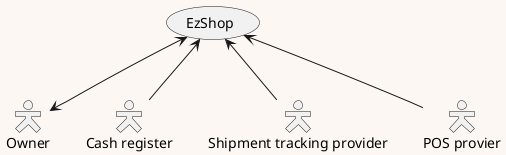
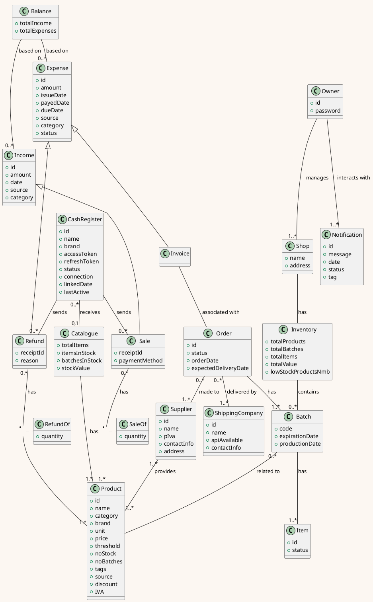
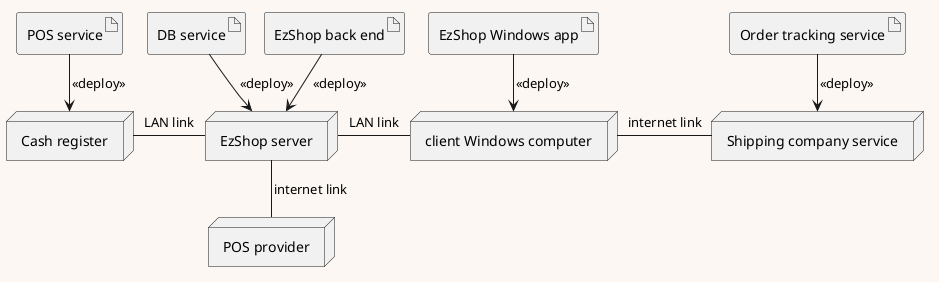

## Context diagram

```plantuml
@startuml contextDiagram
skinparam backgroundColor #fcf7f2
skinparam actorStyle Hollow

usecase "EzShop" as shop
actor "Owner" as owner
actor "Cash register" as cs
actor "Shipment tracking provider" as stp
actor "POS provier" as pos

shop <--> owner 
shop <-- cs
shop <-- stp
shop <-- pos

@enduml

```

---
## Glossary diagram

```plantuml
@startuml glossaryDiagram
!pragma layout smetana
skinparam backgroundColor #fcf7f2

class Shop {
    + name
    + address
}

class Product {
    + id
    + name
    + category
    + brand
    + unit
    + price
    + threshold
    + noStock
    + noBatches
    + tags
    + source
    + discount
    + IVA
}

class Batch {
    + code
    + expirationDate
    + productionDate
}

class Item {
    + id
    + status
}

class Sale {
    + receiptId
    + paymentMethod
}

class Refund {
    + receiptId
    + reason
}

class Catalogue {
    + totalItems
    + itemsInStock
    + batchesInStock
    + stockValue
}

class Inventory {
    + totalProducts
    + totalBatches
    + totalItems
    + totalValue
    + lowStockProductsNmb
}

class Supplier {
    + id
    + name
    + pIva
    + contactInfo
    + address
}

class Invoice {
}

class Order {
    + id
    + status
    + orderDate
    + expectedDeliveryDate
}

class Income {
    + id
    + amount
    + date
    + source
    + category
}

class Expense {
    + id
    + amount
    + issueDate
    + payedDate
    + dueDate
    + source
    + category
    + status
}

class Balance {
    + totalIncome
    + totalExpenses
}

class Owner {
    + id
    + password
}

class CashRegister {
    + id
    + name
    + brand
    + accessToken
    + refreshToken
    + status
    + connection
    + linkedDate
    + lastActive
}

class ShippingCompany {
    + id
    + name
    + apiAvailable
    + contactInfo
}

class Notification {
    + id
    + message
    + date
    + status
    + tag
}


Balance  -- "0..*" Expense: > based on 
Balance  -- "0..*" Income: > based on

Sale "0.*" -- "1.*" Product : > has
Refund "0.*" -- "1.*" Product: > has
Catalogue  -- "1.*" Product: > has
Batch "0..*" --  Product: > related to
Supplier "1..*" -- "1..*" Product: > provides


(Sale, Product) .. SaleOf
class SaleOf{
    + quantity
}
(Refund, Product) .. RefundOf
class RefundOf{
    + quantity
}

Batch  -- "1..*" Item: > has

Order  -- "1..*" Batch: > has
Order "0..*" -- "1..*" Supplier: > made to 
Order "0..*" -- "1..*" ShippingCompany: > delivered by 

Invoice --  Order:> associated with

CashRegister  -- "0..*" Refund: > sends
CashRegister  -- "0..*" Sale: > sends
CashRegister "0..*" -- "0,1" Catalogue: > receives

Inventory  -- "0..*" Batch: > contains

Income <|-- Sale
Expense <|-- Refund
Expense <|-- Invoice


Owner  -- "1..*" Shop:> manages
Owner  -- "1..*" Notification:> interacts with

Shop -- Inventory : > has

Refund .r[hidden]. Catalogue
Catalogue .r[hidden]. Sale


@enduml

```

---
## Deployment diagram

```plantuml
@startuml deploymentDiagram
!pragma layout smetana
skinparam backgroundColor #fcf7f2

' Define artifact symbol with file icon
artifact "POS service" as POS
artifact "EzShop Windows app" as EzShopWinApp
artifact "Order tracking service" as OrderTracking
artifact "DB service" as DBService
artifact "EzShop back end" as EzShopBackEnd

node "Cash register" as CashRegister
node "client Windows computer" as ClientPC
node "Shipping company service" as ShippingService
node "EzShop server" as EzShopServer
node "POS provider" as pos

' Deployment relationships (dashed with <<deploy>>)
POS --> CashRegister : <<deploy>>
EzShopWinApp --> ClientPC : <<deploy>>
OrderTracking --> ShippingService : <<deploy>>
DBService --> EzShopServer : <<deploy>>
EzShopBackEnd --> EzShopServer : <<deploy>>

' Network links (solid lines with labels)
CashRegister -r- EzShopServer : LAN link
ClientPC -l- EzShopServer : LAN link
ClientPC -r- ShippingService : internet link
EzShopServer -- pos: internet link
@enduml

```

